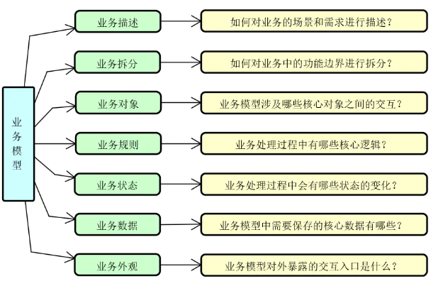
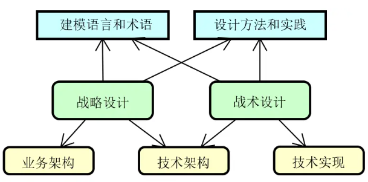

# DDD学习
## 什么是DDD
DDD 提供的是一种开展业务建模和软件设计的方法论。\
强调开发人员与业务领域专家一起进行高效的协作。

针对业务领域，DDD 通过对业务架构和技术架构进行整合，提出了一组核心概念，包括：

- 用于描述业务的通用语言（Ubiquitous Language）；
- 用于对业务进行拆分的限界上下文（Boundary Context）；
- 用于设计业务对象的领域模型对象（Domain Model Object）；
- 用于实现业务规则的领域服务（Domain Service）；
- 用于管理业务状态的领域事件（Domain Event）；
- 用于保存业务数据的资源库（Repository）；
- 用于实现业务交互的应用服务（Application Service）。

### 什么是领域（Domain）？
领域就是指具体的业务概念和业务场景，以及我们为了实现这些业务概念和业务场景所需要执行的操作。

在一个客服服务系统中，就包含了工单、订单、客服等业务概念，而关注于用户提交工单、客服处理工单等业务场景。这里所涉及的业务概念和业务场景都属于领域的范畴。

### 领域与业务模型
把业务模型拆分成七大维度

- 业务描述。业务模型需要通过简洁而通用的语言进行描述，从而确保与模型相关的所有人都能够对模型所代表的业务场景和需求达成统一认识。

- 业务拆分。业务场景的复杂度决定了业务模型中功能组件的数量和关联关系，我们需要通过拆分的方式明确各个功能之间的边界。

- 业务对象。在一个业务场景中，势必存在一组业务对象，这些业务对象通过一定的交互关系构成了具体的业务场景。

- 业务规则。在一个业务模型中，内部的核心逻辑通过一系列的业务规则来进行展现，业务规则代表着具体领域下的业务价值。

- 业务状态。每个业务场景都是有状态的，这些状态构成了业务处理的流程和顺序，也是我们对业务进行建模的重点对象。

- 业务数据。所有业务模型都会产生数据，而且业务规则和业务状态的设计很大程度上都是围绕业务数据的处理过程来展开的，我们需要把核心的业务数据进行持久化保存。

- 业务外观。对于一个业务模型而言，我们都需要和客户端、其他业务模块以及第三方外部系统进行集成，这就需要开放一定的交互入口，我们把这部分内容称为业务外观。

### DDD 的设计方法
- 战略设计方法。所谓战略设计，是一种高阶的设计方法，直接面向业务，其主要目标是清晰区分系统中的不同业务关注点。在实施过程中，战略设计需要考虑各个业务场景下不同业务操作所固有的边界，从而实现对领域的合理划分。从架构设计上讲，战略设计偏向于业务架构的规划和梳理。

- 战术设计方法。相较战略设计，战术设计偏向于技术底层实现。针对战略设计中已经形成的业务领域和边界，战术设计的主要目标是采用合理的、高效的技术手段来实现各个业务操作。显然，战术设计关注技术架构的设计和实现。

## 领域驱动的设计
### 战略设计
通用语言（Ubiquitous Language）和限界上下文（Boundary Context）这两个核心概念

通用语言，也可以被称为统一协作语言，``用来解决在实现业务模型时一个非常重要的问题，即团队所有人如何使用同一种语言来描述业务需求``\
通用语言是业务用词并不是技术用词\
打个比方-：在实际项目中：产品的设计原型，如果同一个东西总是用二种以上语言表述，就会对开发者造成一定困扰！

### 业务拆分与限界上下文
#### domain（领型对象）
领域对象是限界上下文的核心，包含核心业务逻辑的实现。

#### application（应用服务）
应用服务充当限界上下文中领域模型的门面。它们提供一种服务，向底层领域模型发送命令和查询。
- 命令操作和查询操作的分派；
- 与基础设施组件进行交互；
- 对其他限界上下文进行调用等。
#### infrastructure（基础设施）
在一个限界上下文中，基础设施类的组件主要来自两个方面，即资源库（Repository）和消息通信（Messaging）。
- 在DDD中，首选的是Spring Date JPA或者Spring JDBC
#### interfaces（接口）
根据不同种类的通信协议，interfaces 包将所有入站操作封装到当前的限界上下文中，该包的主要用途是基于领域模型暴露对外的接口，这些接口的形式可以是 REST API、WebSocket、RSocket 以及各种自定义协议和交互方式。
interfaces 包主要支持两大类接口。

- 一种是基于 HTTP 协议的 REST API，用来将外部请求转化为内部的 Command 和 Query 对象并交由应用服务进行处理。这样，在转化过程中，通常需要引入专门的 DTO（Data Transfer Object，数据传输对象）对象和组装器（Assembler）对象。
- 另一种则是基于消息通信的事件处理器（Event Handler），用来对来自外部限界上下文的领域实现进行响应。

#### integration（集成）
说白了就是数据出站操作，而interfaces包则提供了数据的入站操作，所以 integration 包中的组件实际上与 interfaces 包中的组件是对应的。

