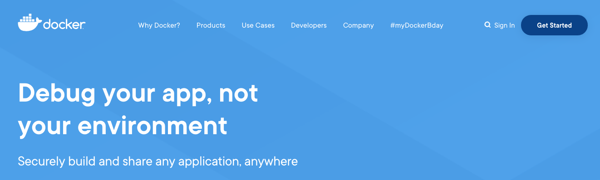
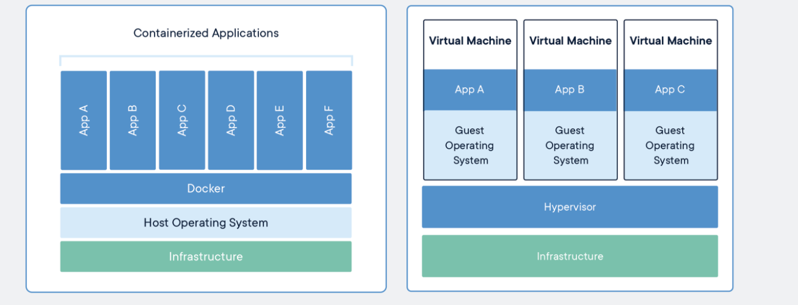
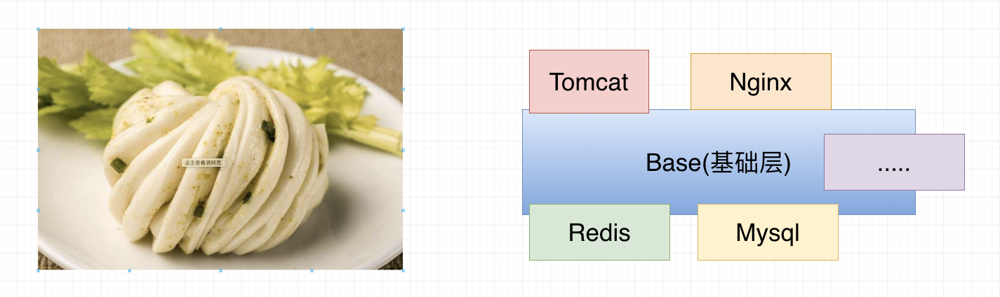
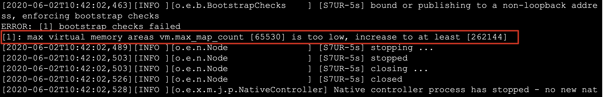
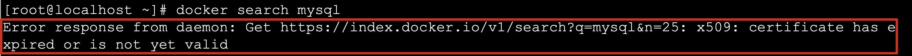
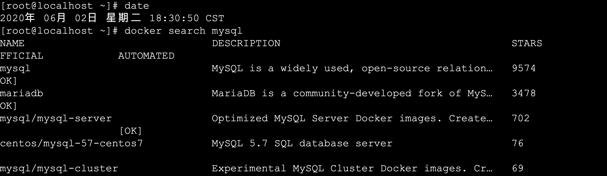
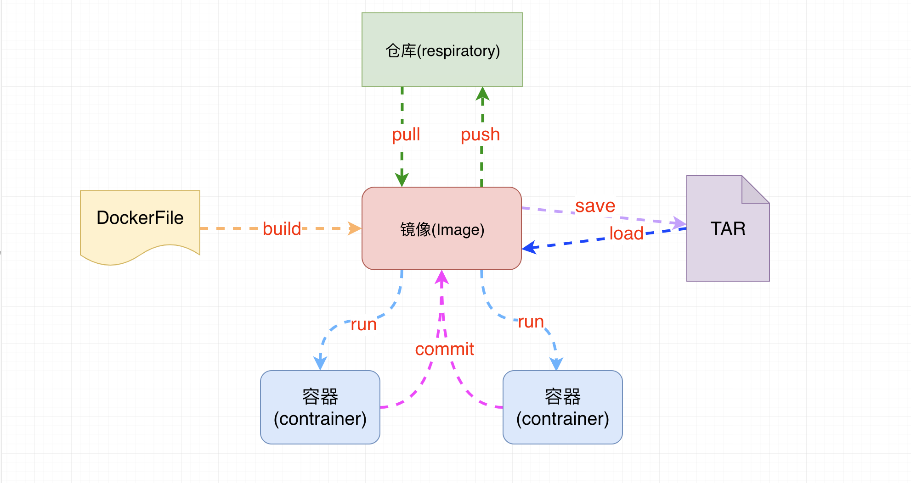
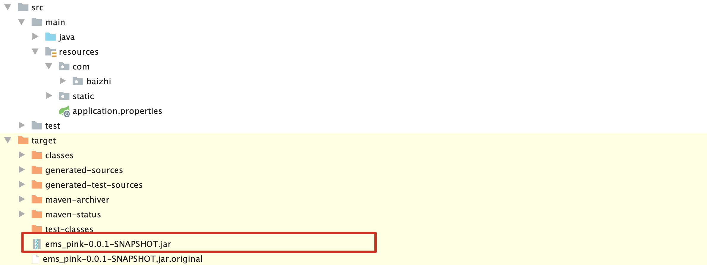
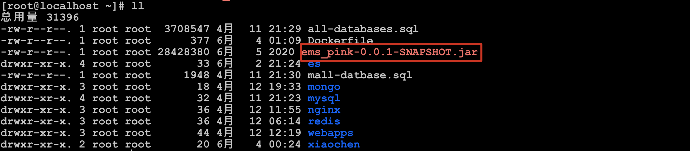
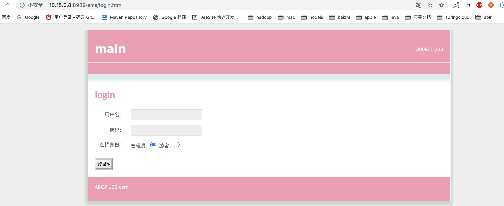

# Docker

- 作者: 小陈
- 微信: chenxu521600
- B站搜索: 编程不良人|百知教育
- 资料下载网站: http://www.baizhiedu.xin

-----

## 1.什么是 Docker



官网的介绍是“`Docker is the world’s leading software container platform.`” 官方给Docker的定位是一个`应用容器平台`。

Docker 是一个容器平台的领导者  Docker 容器平台   Docker 应用容器平台

application项目    Mysql  Redis   MongoDB  ElasticSeacrh   .....

application项目    Docker  应用容器平台  Mysql  Redis  mongoDB   ElasticSearch   tomcat nginx......

## 2.为什么是Docker

- `合作开发的时候，在本机可以跑，别人的电脑跑不起来`

  这里我们拿java Web应用程序举例，我们一个java Web应用程序涉及很多东西，比如jdk、tomcat、spring等等。当这些其中某一项版本不一致的时候，可能就会导致应用程序跑不起来这种情况。Docker则将程序直接打包成镜像，直接运行在容器中即可。

  

- `服务器自己的程序挂了，结果发现是别人程序出了问题把内存吃完了，自己程序因为内存不够就挂了`

  这种也是一种比较常见的情况，如果你的程序重要性不是特别高的话，公司基本上不可能让你的程序独享一台服务器的，这时候你的服务器就会跟公司其他人的程序共享一台服务器，所以不可避免地就会受到其他程序的干扰，导致自己的程序出现问题。Docker就很好解决了环境隔离的问题，别人程序不会影响到自己的程序。

  

- `公司要弄一个活动，可能会有大量的流量进来，公司需要再多部署几十台服务器`

  在没有Docker的情况下，要在几天内部署几十台服务器，这对运维来说是一件非常折磨人的事，而且每台服务器的环境还不一定一样，就会出现各种问题，最后部署地头皮发麻。用Docker的话，我只需要将程序打包到镜像，你要多少台服务，我就给力跑多少容器，极大地提高了部署效率。

----

## 3.Docker和虚拟机区别

> 关于Docker与虚拟机的区别，我在网上找到的一张图，非常直观形象地展示出来，话不多说，直接上图。




`比较上面两张图，我们发现虚拟机是携带操作系统，本身很小的应用程序却因为携带了操作系统而变得非常大，很笨重`。Docker是不携带操作系统的，所以Docker的应用就非常的轻巧。另外在调用宿主机的CPU、磁盘等等这些资源的时候，拿内存举例，虚拟机是利用Hypervisor去虚拟化内存，整个调用过程是虚拟内存->虚拟物理内存->真正物理内存，但是Docker是利用Docker Engine去调用宿主的的资源，这时候过程是虚拟内存->真正物理内存。

|             | 传统虚拟机                           | Docker容器                            |
| ----------- | ------------------------------------ | ------------------------------------- |
| 磁盘占用    | 几个GB到几十个GB左右                 | 几十MB到几百MB左右                    |
| CPU内存占用 | 虚拟操作系统非常占用CPU和内存        | Docker引擎占用极低                    |
| 启动速度    | （从开机到运行项目）几分钟           | （从开启容器到运行项目）几秒          |
| 安装管理    | 需要专门的运维技术                   | 安装、管理方便                        |
| 应用部署    | 每次部署都费时费力                   | 从第二次部署开始轻松简捷              |
| 耦合性      | 多个应用服务安装到一起，容易互相影响 | 每个应用服务一个容器，达成隔离        |
| 系统依赖    | 无                                   | 需求相同或相似的内核，目前推荐是Linux |

----

## 4.Docker 的核心


- `镜像:` 一个镜像代表一个应用环境,他是一个只读的文件,如 mysql镜像,tomcat镜像,nginx镜像等
- `容器:` 镜像每次运行之后就是产生一个容器,就是正在运行的镜像,特点就是可读可写
- `仓库:`用来存放镜像的位置,类似于maven仓库,也是镜像下载和上传的位置
- `dockerFile:`docker生成镜像配置文件,用来书写自定义镜像的一些配置
- `tar:`一个对镜像打包的文件,日后可以还原成镜像

## 4.Docker的安装(centos7.x)

### 5.1 卸载原有 docker

```shell
$ sudo yum remove docker \
                  docker-client \
                  docker-client-latest \
                  docker-common \
                  docker-latest \
                  docker-latest-logrotate \
                  docker-logrotate \
                  docker-engine
```

### 5.2 安装docker

> 安装docker依赖

```shell
$ sudo yum install -y yum-utils \
  device-mapper-persistent-data \
  lvm2
```

> 设置docker的yum源

```shell
$ sudo yum-config-manager \
    --add-repo \
    https://download.docker.com/linux/centos/docker-ce.repo
```

> 安装最新版的docker

```shell
$ sudo yum install docker-ce docker-ce-cli containerd.io
```

> 指定版本安装docker

```shell
$ yum list docker-ce --showduplicates | sort -r
$ sudo yum install docker-ce-<VERSION_STRING> docker-ce-cli-<VERSION_STRING> containerd.io
$ sudo yum install docker-ce-18.09.5-3.el7 docker-ce-cli-18.09.5-3.el7 containerd.io
```

> 启动docker

```shell
$ sudo systemctl start docker
```

> 关闭docker

```shell
$ sudo systemctl stop docker
```

> 测试docker安装

```shell
$ sudo docker run hello-world
```

------

## 6. Docker 配置阿里镜像加速服务

### 6.1 docker 运行流程


### 6.2 docker配置阿里云镜像加速

- `访问阿里云登录自己账号查看docker镜像加速服务`

```shell
sudo mkdir -p /etc/docker
sudo tee /etc/docker/daemon.json <<-'EOF'
{
  "registry-mirrors": ["https://lz2nib3q.mirror.aliyuncs.com"]
}
EOF
sudo systemctl daemon-reload
sudo systemctl restart docker
```

- `验证docker的镜像加速是否生效`

```shell
[root@localhost ~]# docker info
		..........
    127.0.0.0/8
   Registry Mirrors:
    'https://lz2nib3q.mirror.aliyuncs.com/'
   Live Restore Enabled: false
   Product License: Community Engine
```

-----

## 7.Docker的入门应用

### 7.1 docker 的第一个程序

> docker  run hello-world

```shell
[root@localhost ~]# docker run hello-world

Hello from Docker!
This message shows that your installation appears to be working correctly.

To generate this message, Docker took the following steps:
 1. The Docker client contacted the Docker daemon.
 2. The Docker daemon pulled the "hello-world" image from the Docker Hub.
    (amd64)
 3. The Docker daemon created a new container from that image which runs the
    executable that produces the output you are currently reading.
 4. The Docker daemon streamed that output to the Docker client, which sent it
    to your terminal.

To try something more ambitious, you can run an Ubuntu container with:
 $ docker run -it ubuntu bash

Share images, automate workflows, and more with a free Docker ID:
 https://hub.docker.com/

For more examples and ideas, visit:
 https://docs.docker.com/get-started/
```

----

## 8.常用命令

### 6.1 辅助命令

~~~markdown
# 1.安装完成辅助命令

		docker version	--------------------------	查看docker的信息
		docker info		--------------------------	查看更详细的信息
		docker --help	--------------------------	帮助命令
~~~

### 6.2 Images 镜像命令

~~~markdown
# 1.查看本机中所有镜像
	docker images	--------------------------	列出本地所有镜像
		-a			列出所有镜像（包含中间映像层）
  	-q			只显示镜像id

# 2.搜索镜像
	docker search [options] 镜像名	-------------------	去dockerhub上查询当前镜像
		-s 指定值		列出收藏数不少于指定值的镜像
  	--no-trunc	  显示完整的镜像信息

# 3.从仓库下载镜像
	docker pull 镜像名[:TAG|@DIGEST]	----------------- 下载镜像

# 4.删除镜像
	docker rmi 镜像名	--------------------------  删除镜像
		-f		强制删除
~~~

### 6.3 Contrainer 容器命令

#### 6.3.1 基本命令(容器外操作)

~~~markdown
# 1.运行容器
	docker run 镜像名	--------------------------	镜像名新建并启动容器
    --name 					别名为容器起一个名字
    -d							启动守护式容器（在后台启动容器）
    -p 							映射端口号：原始端口号		 指定端口号启动

	例：docker run -it --name myTomcat -p 8888:8080 tomcat
   	 docker run -d --name myTomcat -P tomcat

# 2.查看运行的容器
	docker ps					--------------------------	列出所有正在运行的容器
	-a			正在运行的和历史运行过的容器
	-q			静默模式，只显示容器编号

# 3.停止|关闭|重启容器
	docker start   容器名字或者容器id  --------------- 开启容器
	docker restart 容器名或者容器id    --------------- 重启容器
	docker stop  容器名或者容器id 	    ------------------ 正常停止容器运行
	docker kill  容器名或者容器id      ------------------ 立即停止容器运行

# 4.删除容器
	docker rm -f 容器id和容器名     
	docker rm -f $(docker ps -aq)		--------------------------	删除所有容器

# 5.查看容器内进程
	docker top 容器id或者容器名 ------------------ 查看容器内的进程

# 6.查看查看容器内部细节
	docker inspect 容器id 		------------------ 查看容器内部细节

# 7.查看容器的运行日志
	docker logs [OPTIONS] 容器id或容器名	------------------ 查看容器日志
    -t			 加入时间戳
    -f			 跟随最新的日志打印
    --tail 	 数字	显示最后多少条

~~~

#### 6.3.2 进阶命令(容器内数据交互)

centos ----> docker(引擎) ---->  mynginx(容器) 

~~~markdown

# 1.进入容器内部
	docker exec [options] 容器id 容器内命令 ------------------ 进入容器执行命令
		-i		以交互模式运行容器，通常与-t一起使用
    -t		分配一个伪终端    shell窗口   /bin/bash 

# 2.容器内安装软件
	apt-get update
	apt-get install 安装包名称

# 3.修改容器内文件
	
# 4.退出容器
	exit		退出容器

# 5.将容器打包为新的镜像
	docker commit -a="作者" -m="描述信息" 容器ID 目标镜像名称:TAG

# 6.从容器中复制文件到宿主机目录中
	docker cp 容器id:容器内资源路径 宿主机目录路径  -----------------   将容器内资源拷贝到主机上

# 7.设置容器和宿主机共享目录
		docker run -it -v /宿主机的路径:/容器内的路径:ro(只读) 镜像名
			注意: 宿主机路径必须是绝对路径,宿主机目录会覆盖容器内目录内容	
		运行 docker inspect 容器id 命令 检查json串里有没有以下内容，如果有则证明卷挂载成功。
		"Mounts": [
            {
                "Type": "bind",
                "Source": "/hostDataValueme",
                "Destination": "/containerDataValueme",
                "Mode": "",
                "RW": true,
                "Propagation": "rprivate"
            }
        ]

# 8.打包镜像
		docker save 镜像名 -o  名称.tar
# 9.载入镜像
		docker load -i   名称.tar
~~~

----

## 7.docker的镜像原理

### 7.1 镜像是什么？

> 镜像是一种轻量级的，可执行的独立软件包，用来打包软件运行环境和基于运行环境开发的软件，它包含运行某个软件所需的所有内容，包括代码、运行时所需的库、环境变量和配置文件。

### 7.2 为什么一个镜像会那么大？



`镜像就是花卷`

-  UnionFS（联合文件系统）:
  - Union文件系统是一种分层，轻量级并且高性能的文件系统，它支持对文件系统的修改作为一次提交来一层层的叠加，同时可以将不同目录挂载到同一个虚拟文件系统下。Union文件系统是Docker镜像的基础。这种文件系统特性:就是一次同时加载多个文件系统，但从外面看起来，只能看到一个文件系统，联合加载会把各层文件系统叠加起来，这样最终的文件系统会包含所有底层的文件和目录 。	

### 7.3 Docker镜像原理

> `docker的镜像实际是由一层一层的文件系统组成。`

- bootfs（boot file system）主要包含bootloader和kernel，bootloader主要是引导加载kernel，Linux刚启动时会加载bootfs文件系统。在docker镜像的最底层就是bootfs。这一层与Linux/Unix 系统是一样的，包含boot加载器（bootloader）和内核（kernel）。当boot加载完,后整个内核就都在内存中了，此时内存的使用权已由bootfs转交给内核，此时会卸载bootfs。

- rootfs（root file system），在bootfs之上，包含的就是典型的linux系统中的/dev，/proc，/bin，/etc等标准的目录和文件。rootfs就是各种不同的操作系统发行版，比如Ubuntu/CentOS等等。

  

- 我们平时安装进虚拟机的centos都有1到几个GB，为什么docker这里才200MB？对于一个精简的OS，rootfs可以很小，只需要包括最基本的命令，工具，和程序库就可以了，因为底层直接使用Host的Kernal，自己只需要提供rootfs就行了。由此可见不同的linux发行版，他们的bootfs是一致的，rootfs会有差别。因此不同的发行版可以共用bootfs。


.jpg)

### 7.4 为什么docker镜像要采用这种分层结构呢?

> `最大的一个好处就是资源共享`

- 比如：有多个镜像都是从相同的base镜像构建而来的，那么宿主机只需在磁盘中保存一份base镜像。同时内存中也只需要加载一份base镜像，就可以为所有容器服务了。而且镜像的每一层都可以被共享。Docker镜像都是只读的。当容器启动时，一个新的可写层被加载到镜像的顶部。这一层通常被称为容器层，容器层之下都叫镜像层。

---

## 8.Docker安装常用服务

### 8.1 安装mysql

```markdown
# 1.拉取mysql镜像到本地
	docker pull mysql:tag (tag不加默认最新版本)
	
# 2.运行mysql服务
	docker run --name mysql -e MYSQL_ROOT_PASSWORD=root -d mysql:tag  						  --没有暴露外部端口外部不能连接
	docker run --name mysql -e MYSQL_ROOT_PASSWORD=root -p 3306:3306 -d  mysql:tag  --没有暴露外部端口

# 3.进入mysql容器
	docker exec -it 容器名称|容器id bash

# 4.外部查看mysql日志
	docker logs 容器名称|容器id

# 5.使用自定义配置参数
	docker run --name mysql -v /root/mysql/conf.d:/etc/mysql/conf.d -e MYSQL_ROOT_PASSWORD=root -d mysql:tag

# 6.将容器数据位置与宿主机位置挂载保证数据安全
	docker run --name mysql -v /root/mysql/data:/var/lib/mysql -v /root/mysql/conf.d:/etc/mysql/conf.d -e MYSQL_ROOT_PASSWORD=root -p 3306:3306 -d mysql:tag

# 7.通过其他客户端访问 如在window系统|macos系统使用客户端工具访问
	
# 8.将mysql数据库备份为sql文件
	docker exec mysql|容器id sh -c 'exec mysqldump --all-databases -uroot -p"$MYSQL_ROOT_PASSWORD"' > /root/all-databases.sql  --导出全部数据
	docker exec mysql sh -c 'exec mysqldump --databases 库表 -uroot -p"$MYSQL_ROOT_PASSWORD"' > /root/all-databases.sql  --导出指定库数据
	docker exec mysql sh -c 'exec mysqldump --no-data --databases 库表 -uroot -p"$MYSQL_ROOT_PASSWORD"' > /root/all-databases.sql  --导出指定库数据不要数据

# 9.执行sql文件到mysql中
	docker exec -i mysql sh -c 'exec mysql -uroot -p"$MYSQL_ROOT_PASSWORD"' < /root/xxx.sql
```

### 8.2 安装Redis服务

```markdown
# 1.在docker hub搜索redis镜像
	docker search redis

# 2.拉取redis镜像到本地
	docker pull redis

# 3.启动redis服务运行容器
	docker run --name redis -d redis:tag (没有暴露外部端口)
	docker run --name redis -p 6379:6379 -d redis:tag (暴露外部宿主机端口为6379进行连接) 

# 4.查看启动日志
	docker logs -t -f 容器id|容器名称

# 5.进入容器内部查看
	docker exec -it 容器id|名称 bash  

# 6.加载外部自定义配置启动redis容器
	默认情况下redis官方镜像中没有redis.conf配置文件 需要去官网下载指定版本的配置文件
	1. wget http://download.redis.io/releases/redis-5.0.8.tar.gz  下载官方安装包
	2. 将官方安装包中配置文件进行复制到宿主机指定目录中如 /root/redis/redis.conf文件
	3. 修改需要自定义的配置
		 bind 0.0.0.0 开启远程权限
		 appenonly yes 开启aof持久化
	4. 加载配置启动
	docker run --name redis -v /root/redis:/usr/local/etc/redis -p 6379:6379 -d redis redis-server /usr/local/etc/redis/redis.conf  

# 7.将数据目录挂在到本地保证数据安全
	docker run --name redis -v /root/redis/data:/data -v /root/redis/redis.conf:/usr/local/etc/redis/redis.conf -p 6379:6379 -d redis redis-server 					/usr/local/etc/redis/redis.conf  
```

### 8.3 安装Nginx

```markdown
# 1.在docker hub搜索nginx
	docker search nginx

# 2.拉取nginx镜像到本地
	[root@localhost ~]# docker pull nginx
    Using default tag: latest
    latest: Pulling from library/nginx
    afb6ec6fdc1c: Pull complete 
    b90c53a0b692: Pull complete 
    11fa52a0fdc0: Pull complete 
    Digest: sha256:30dfa439718a17baafefadf16c5e7c9d0a1cde97b4fd84f63b69e13513be7097
    Status: Downloaded newer image for nginx:latest
    docker.io/library/nginx:latest

# 3.启动nginx容器
		docker run -p 80:80 --name nginx01 -d nginx

# 4.进入容器
		docker exec -it nginx01 /bin/bash
		查找目录:  whereis nginx
		配置文件:  /etc/nginx/nginx.conf

# 5.复制配置文件到宿主机
		docker cp nginx01(容器id|容器名称):/etc/nginx/nginx.conf 宿主机名录

# 6.挂在nginx配置以及html到宿主机外部
		docker run --name nginx02 -v /root/nginx/nginx.conf:/etc/nginx/nginx.conf -v /root/nginx/html:/usr/share/nginx/html -p 80:80 -d nginx		
```

----

### 8.4 安装Tomcat

```markdown
# 1.在docker hub搜索tomcat
	docker search tomcat

# 2.下载tomcat镜像
	docker pull tomcat

# 3.运行tomcat镜像
	docker run -p 8080:8080 -d --name mytomcat tomcat

# 4.进入tomcat容器
	docker exec -it mytomcat /bin/bash

# 5.将webapps目录挂载在外部
	docker run -p 8080:8080 -v /root/webapps:/usr/local/tomcat/webapps -d --name mytomcat tomcat

```

-----

### 8.5 安装MongoDB数据库

```markdown
# 1.运行mongDB
	docker run -d -p 27017:27017 --name mymongo mongo  ---无须权限
	docker logs -f mymongo --查看mongo运行日志

# 2.进入mongodb容器
	docker exec -it mymongo /bin/bash
		直接执行mongo命令进行操作

# 3.常见具有权限的容器
	docker run --name  mymongo  -p 27017:27017  -d mongo --auth

# 4.进入容器配置用户名密码
	mongo
	use admin 选择admin库
	db.createUser({user:"root",pwd:"root",roles:[{role:'root',db:'admin'}]})   //创建用户,此用户创建成功,则后续操作都需要用户认证
	exit

# 5.将mongoDB中数据目录映射到宿主机中
	docker run -d -p 27017:27017 -v /root/mongo/data:/data/db --name mymongo mongo 
```

### 8.6 安装ElasticSearch

- `注意:`**调高JVM线程数限制数量**

#### 0.拉取镜像运行elasticsearch

```markdown
# 1.dockerhub 拉取镜像
	docker pull elasticsearch:6.4.2
# 2.查看docker镜像
	docker images
# 3.运行docker镜像
	docker run -p 9200:9200 -p 9300:9300 elasticsearch:6.4.2
```

- 启动出现如下错误
- 

#### 1. 预先配置

```markdown
# 1.在centos虚拟机中，修改配置sysctl.conf
	vim /etc/sysctl.conf
# 2.加入如下配置
	vm.max_map_count=262144 
# 3.启用配置
	sysctl -p
	注：这一步是为了防止启动容器时，报出如下错误：
	bootstrap checks failed max virtual memory areas vm.max_map_count [65530] likely too low, increase to at least [262144]

```

#### 2.启动EleasticSearch容器

```markdown
# 0.复制容器中data目录到宿主机中
	docker cp 容器id:/usr/share/share/elasticsearch/data /root/es
# 1.运行ES容器 指定jvm内存大小并指定ik分词器位置
	docker run -d --name es -p 9200:9200 -p 9300:9300 -e ES_JAVA_OPTS="-Xms128m -Xmx128m" -v /root/es/plugins:/usr/share/elasticsearch/plugins -v /root/es/data:/usr/share/elasticsearch/data elasticsearch:6.4.2
```

#### 3.安装IK分词器

```markdown
# 1.下载对应版本的IK分词器
	wget https://github.com/medcl/elasticsearch-analysis-ik/releases/download/v6.4.2/elasticsearch-analysis-ik-6.4.2.zip

# 2.解压到plugins文件夹中
	yum install -y unzip
	unzip -d ik elasticsearch-analysis-ik-6.4.2.zip

# 3.添加自定义扩展词和停用词
	cd plugins/elasticsearch/config
	vim IKAnalyzer.cfg.xml
	<properties>
		<comment>IK Analyzer 扩展配置</comment>
		<!--用户可以在这里配置自己的扩展字典 -->
		<entry key="ext_dict">ext_dict.dic</entry>
		<!--用户可以在这里配置自己的扩展停止词字典-->
		<entry key="ext_stopwords">ext_stopwords.dic</entry>
	</properties>

# 4.在ik分词器目录下config目录中创建ext_dict.dic文件   编码一定要为UTF-8才能生效
	vim ext_dict.dic 加入扩展词即可
# 5. 在ik分词器目录下config目录中创建ext_stopword.dic文件 
	vim ext_stopwords.dic 加入停用词即可

# 6.重启容器生效
	docker restart 容器id
# 7.将此容器提交成为一个新的镜像
	docker commit -a="xiaochen" -m="es with IKAnalyzer" 容器id xiaochen/elasticsearch:6.4.2
```

#### 4. 安装Kibana

```markdown
# 1.下载kibana镜像到本地
	docker pull kibana:6.4.2

# 2.启动kibana容器
	docker run -d --name kibana -e ELASTICSEARCH_URL=http://10.15.0.3:9200 -p 5601:5601 kibana:6.4.2
```

----

## 10.Docker中出现如下错误解决方案

```powershell
[root@localhost ~]# docker search mysql 或者 docker pull 这些命令无法使用
Error response from daemon: Get https://index.docker.io/v1/search?q=mysql&n=25: x509: certificate has expired or is not yet valid
```



- 注意:**这个错误的原因在于是系统的时间和docker hub时间不一致,需要做系统时间与网络时间同步**

```markdown
# 1.安装时间同步
	sudo yum -y install ntp ntpdate
# 2.同步时间
	sudo ntpdate cn.pool.ntp.org
# 3.查看本机时间
	date
# 4.从新测试
```



## 9.Dockerfile

### 9.1 什么是Dockerfile

Dockerfile可以认为是**Docker镜像的描述文件，是由一系列命令和参数构成的脚本**。主要作用是**用来构建docker镜像的构建文件**。



- **通过架构图可以看出通过DockerFile可以直接构建镜像**

### 9.2 Dockerfile解析过程


### 9.3 Dockerfile的保留命令

官方说明:https://docs.docker.com/engine/reference/builder/

| 保留字         | 作用                                                         |
| -------------- | ------------------------------------------------------------ |
| **FROM**       | **当前镜像是基于哪个镜像的** `第一个指令必须是FROM`          |
| MAINTAINER     | 镜像维护者的姓名和邮箱地址                                   |
| **RUN**        | **构建镜像时需要运行的指令**                                 |
| **EXPOSE**     | **当前容器对外暴露出的端口号**                               |
| **WORKDIR**    | **指定在创建容器后，终端默认登录进来的工作目录，一个落脚点** |
| **ENV**        | **用来在构建镜像过程中设置环境变量**                         |
| **ADD**        | **将宿主机目录下的文件拷贝进镜像且ADD命令会自动处理URL和解压tar包** |
| **COPY**       | **类似于ADD，拷贝文件和目录到镜像中<br/>将从构建上下文目录中<原路径>的文件/目录复制到新的一层的镜像内的<目标路径>位置** |
| **VOLUME**     | **容器数据卷，用于数据保存和持久化工作**                     |
| **CMD**        | **指定一个容器启动时要运行的命令<br/>Dockerfile中可以有多个CMD指令，但只有最后一个生效，CMD会被docker run之后的参数替换** |
| **ENTRYPOINT** | **指定一个容器启动时要运行的命令<br/>ENTRYPOINT的目的和CMD一样，都是在指定容器启动程序及其参数** |

#### 9.3.1 FROM 命令

- 基于那个镜像进行构建新的镜像,在构建时会自动从docker hub拉取base镜像 必须作为Dockerfile的第一个指令出现

- 语法:

  ```dockerfile
  FROM  <image>
  FROM  <image>[:<tag>]     使用版本不写为latest
  FROM  <image>[@<digest>]  使用摘要
  ```

#### 9.3.2 MAINTAINER  命令

- 镜像维护者的姓名和邮箱地址[废弃]

- 语法:

  ```dockerfile
  MAINTAINER <name>
  ```

#### 9.3.3 RUN 命令

- RUN指令将在当前映像之上的新层中执行任何命令并提交结果。生成的提交映像将用于Dockerfile中的下一步

- 语法:

  ```dockerfile
  RUN <command> (shell form, the command is run in a shell, which by default is /bin/sh -c on Linux or cmd /S /C on Windows)
  RUN echo hello
  
  RUN ["executable", "param1", "param2"] (exec form)
  RUN ["/bin/bash", "-c", "echo hello"]
  ```

#### 9.3.4 EXPOSE 命令

- 用来指定构建的镜像在运行为容器时对外暴露的端口

- 语法:

  ```dockerfile
  EXPOSE 80/tcp  如果没有显示指定则默认暴露都是tcp
  EXPOSE 80/udp
  ```

#### 9.3.5 CMD 命令

- 用来为启动的容器指定执行的命令,在Dockerfile中只能有一条CMD指令。如果列出多个命令，则只有最后一个命令才会生效。

- 注意: **Dockerfile中只能有一条CMD指令。如果列出多个命令，则只有最后一个命令才会生效。**

- 语法:

  ```dockerfile
  CMD ["executable","param1","param2"] (exec form, this is the preferred form)
  CMD ["param1","param2"] (as default parameters to ENTRYPOINT)
  CMD command param1 param2 (shell form)
  ```

#### 9.3.6 WORKDIR 命令

- 用来为Dockerfile中的任何RUN、CMD、ENTRYPOINT、COPY和ADD指令设置工作目录。如果WORKDIR不存在，即使它没有在任何后续Dockerfile指令中使用，它也将被创建。

- 语法:

  ```dockerfile
  WORKDIR /path/to/workdir
  
  WORKDIR /a
  WORKDIR b
  WORKDIR c
  `注意:WORKDIR指令可以在Dockerfile中多次使用。如果提供了相对路径，则该路径将与先前WORKDIR指令的路径相对`
  ```

#### 9.3.7 ENV 命令

- 用来为构建镜像设置环境变量。这个值将出现在构建阶段中所有后续指令的环境中。

- 语法：

  ```dockerfile
  ENV <key> <value>
  ENV <key>=<value> ...
  ```

#### 9.3.8 ADD 命令

- 用来从context上下文复制新文件、目录或远程文件url，并将它们添加到位于指定路径的映像文件系统中。

- 语法:

  ```dockerfile
  ADD hom* /mydir/       通配符添加多个文件
  ADD hom?.txt /mydir/   通配符添加
  ADD test.txt relativeDir/  可以指定相对路径
  ADD test.txt /absoluteDir/ 也可以指定绝对路径
  ADD url 
  ```

#### 9.3.9 COPY 命令

- 用来将context目录中指定文件复制到镜像的指定目录中

- 语法:

  ```dockerfile
  COPY src dest
  COPY ["<src>",... "<dest>"]
  ```

#### 9.3.10 VOLUME 命令

- 用来定义容器运行时可以挂在到宿主机的目录

- 语法:

  ```dockerfile
  VOLUME ["/data"]
  ```

#### 9.3.11 ENTRYPOINT命令

- 用来指定容器启动时执行命令和CMD类似

- 语法:

  ```dockerfile
  ENTRYPOINT ["executable", "param1", "param2"]
  ENTRYPOINT command param1 param2
  ```

  ENTRYPOINT指令，往往用于设置容器启动后的**第一个命令**，这对一个容器来说往往是固定的。
  CMD指令，往往用于设置容器启动的第一个命令的**默认参数**，这对一个容器来说可以是变化的。

#### 9.3.11 ENTRYPOINT命令

### 9.4 Dockerfile构建springboot项目部署

##### 1.准备springboot可运行项目



##### 2.将可运行项目放入linux虚拟机中



##### 3.编写Dockerfile

```dockerfile
FROM openjdk:8
WORKDIR /ems
ADD ems.jar /ems
EXPOSE 8989
ENTRYPOINT ["java","-jar"]
CMD ["ems.jar"]
```

##### 4.构建镜像

```shell
[root@localhost ems]# docker build -t ems .
```

##### 5.运行镜像

```shell
[root@localhost ems]# docker run -p 8989:8989 ems
```

##### 6.访问项目

```http
http://10.15.0.8:8989/ems/login.html
```



##### 7.接口docker容器之间网络互通问题

