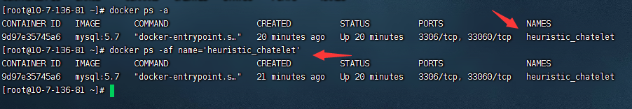

# 安装
## CentOS下安装
```java
1、更新源
yum -y update

2、安装docker
yum -y install docker

3、查看docker版本
docker version

4、启动 重启 开机自启
sudo systemctl start docker
sudo systemctl restart docker
systemctl enable docker
```
## ps命令
```java
Usage:  docker ps [OPTIONS]

List containers

Options:
  -a, --all             显示所有容器（默认显示正在运行）
  -f, --filter filter   根据提供的条件过滤输出
      --format string   使用Go模板的漂亮打印容器
      --help            打印使用
  -n, --last int        显示最后创建的n个容器（包括所有状态）（默认值为-1）
  -l, --latest          显示最新创建的容器（包括所有状态）
      --no-trunc        不要截断输出
  -q, --quiet           仅显示数字ID
  -s, --size            显示总文件大小

```
### -a 显示所有容器
```shell
[root@10-7-136-81 ~]# docker ps -a
CONTAINER ID   IMAGE       COMMAND                  CREATED          STATUS          PORTS                 NAMES
9d97e35745a6   mysql:5.7   "docker-entrypoint.s…"   17 minutes ago   Up 17 minutes   3306/tcp, 33060/tcp   heuristic_chatelet

```
### -f , --filter 过滤

### -q 只显示id
```shell
[root@10-7-136-81 ~]# docker ps -aq
9d97e35745a6

```
## run 运行容器
```shell
Usage:  docker run [OPTIONS] IMAGE [COMMAND] [ARG...]

Run a command in a new container

Options:
      
  -d, --detach                                在后台运行容器并打印container ID
  -i, --interactive                           保持STDIN打开，即使未连接
  -p, --publish list                          将容器的端口发布到主机（默认值[]）
  -P, --publish-all                           将所有公开端口发布到随机端口
      --restart string                        容器退出时应用的重新启动策略（默认为“否”）
      --name string                           为容器指定一个名称
  -t, --tty                                   分配一个伪TTY


```
### -dit 后台运行，打开STDIN并分配一个伪TTY
```shell
[root@10-7-136-81 ~]# docker run -dit nginx
Unable to find image 'nginx:latest' locally
latest: Pulling from library/nginx
e9995326b091: Pull complete 
71689475aec2: Pull complete 
f88a23025338: Pull complete 
0df440342e26: Pull complete 
eef26ceb3309: Pull complete 
8e3ed6a9e43a: Pull complete 
Digest: sha256:943c25b4b66b332184d5ba6bb18234273551593016c0e0ae906bab111548239f
Status: Downloaded newer image for nginx:latest
ec3b9b1f3892eed7b42784b4e070df58e9724546a4ec85a9849fcb9dab65eec6
[root@10-7-136-81 ~]# docker ps -a
CONTAINER ID   IMAGE       COMMAND                  CREATED          STATUS          PORTS                 NAMES
ec3b9b1f3892   nginx       "/docker-entrypoint.…"   8 seconds ago    Up 7 seconds    80/tcp                intelligent_nobel
9d97e35745a6   mysql:5.7   "docker-entrypoint.s…"   24 minutes ago   Up 24 minutes   3306/tcp, 33060/tcp   heuristic_chatelet
```
### --name 设定名字
```shell
[root@10-7-136-81 ~]# docker run -dit --name nginx_name nginx
cf7e92c8eca56785d555b95d76acbbf22c7904d481a039fc67c006eb771db543
[root@10-7-136-81 ~]# docker ps -a
CONTAINER ID   IMAGE       COMMAND                  CREATED              STATUS              PORTS                 NAMES
cf7e92c8eca5   nginx       "/docker-entrypoint.…"   12 seconds ago       Up 11 seconds       80/tcp                nginx_name
ec3b9b1f3892   nginx       "/docker-entrypoint.…"   About a minute ago   Up About a minute   80/tcp                intelligent_nobel
9d97e35745a6   mysql:5.7   "docker-entrypoint.s…"   26 minutes ago       Up 26 minutes       3306/tcp, 33060/tcp   heuristic_chatelet

```
### -p 指定端口/ -P 随机端口
```shell
# -p指定端口
[root@base ~]# docker run -dit --name nginx -p 8080:80 nginx
c484ad61ed99710970889a54c94af47fdb6c50096331ac75e022e2b8383ec14a
[root@base ~]# curl localhost:8080
<!DOCTYPE html>
<html>
<head>
<title>Welcome to nginx!</title>
<style>
html { color-scheme: light dark; }
body { width: 35em; margin: 0 auto;
font-family: Tahoma, Verdana, Arial, sans-serif; }
</style>
</head>
<body>
<h1>Welcome to nginx!</h1>
<p>If you see this page, the nginx web server is successfully installed and
working. Further configuration is required.</p>

<p>For online documentation and support please refer to
<a href="http://nginx.org/">nginx.org</a>.<br/>
Commercial support is available at
<a href="http://nginx.com/">nginx.com</a>.</p>

<p><em>Thank you for using nginx.</em></p>
</body>
</html>


# -P 随机端口（32768起）
[root@base ~]# docker run -dit --name nginx_P -P nginx
3bbda870da081d5bd79e1bcc5c1ef6364382264f1f59d57ba45441af2f1c5161
[root@base ~]# docker ps -a
CONTAINER ID        IMAGE               COMMAND                  CREATED              STATUS                     PORTS                   NAMES
3bbda870da08        nginx               "/docker-entrypoin..."   2 seconds ago        Up 2 seconds               0.0.0.0:32768->80/tcp   nginx_P
c484ad61ed99        nginx               "/docker-entrypoin..."   About a minute ago   Up About a minute          0.0.0.0:8080->80/tcp    nginx
88958f0f4fc8        centos-7            "/bin/bash"              2 weeks ago          Exited (137) 2 weeks ago                           centos7
[root@base ~]# curl localhost:32768
<!DOCTYPE html>
<html>
<head>
<title>Welcome to nginx!</title>
<style>
html { color-scheme: light dark; }
body { width: 35em; margin: 0 auto;
font-family: Tahoma, Verdana, Arial, sans-serif; }
</style>
</head>
<body>
<h1>Welcome to nginx!</h1>
<p>If you see this page, the nginx web server is successfully installed and
working. Further configuration is required.</p>

<p>For online documentation and support please refer to
<a href="http://nginx.org/">nginx.org</a>.<br/>
Commercial support is available at
<a href="http://nginx.com/">nginx.com</a>.</p>

<p><em>Thank you for using nginx.</em></p>
</body>
</html>

```

## rm 删除容器
```shell
Usage:  docker rm [OPTIONS] CONTAINER [CONTAINER...]

Remove one or more containers

Options:
  -f, --force     Force the removal of a running container (uses SIGKILL)
      --help      Print usage
  -l, --link      Remove the specified link
  -v, --volumes   Remove the volumes associated with the container


```
```shell
[root@10-7-136-81 ~]# docker rm nginx
Error response from daemon: You cannot remove a running container 7e3c1a33ffbfc670eaccc0478e314b3d35b54d457341a27d82e84d9b5388f3a9. Stop the container before attempting removal or force remove

运行中的无法删除
```
### -f 强制删除容器
```shell
[root@10-7-136-81 ~]# docker rm -f nginx
nginx
[root@10-7-136-81 ~]# docker ps -a
CONTAINER ID   IMAGE       COMMAND                  CREATED          STATUS          PORTS                 NAMES
cf7e92c8eca5   nginx       "/docker-entrypoint.…"   8 minutes ago    Up 8 minutes    80/tcp                nginx_name
ec3b9b1f3892   nginx       "/docker-entrypoint.…"   10 minutes ago   Up 10 minutes   80/tcp                intelligent_nobel
9d97e35745a6   mysql:5.7   "docker-entrypoint.s…"   34 minutes ago   Up 34 minutes   3306/tcp, 33060/tcp   heuristic_chatelet

```
## image 列表
```shell
Usage:  docker image ls [OPTIONS] [REPOSITORY[:TAG]]

List images

Aliases:
  ls, images, list

Options:
  -a, --all             显示所有图像(默认隐藏中间图像)
      --digests         显示摘要
  -f, --filter filter   根据提供的条件过滤输出
      --format string   使用Go模板打印漂亮的图片
      --help            打印使用
      --no-trunc        不截断输出
  -q, --quiet           只显示数字id
```
### -a 列出所有Image
```shell
[root@10-7-136-81 ~]# docker image ls -a
REPOSITORY   TAG       IMAGE ID       CREATED       SIZE
mysql        5.7       eef0fab001e8   4 days ago    495MB
nginx        latest    76c69feac34e   2 weeks ago   142MB

```
### -q 只显示数字id
```shell
[root@base ~]# docker image ls -q
7e989e1e46e7
b692a91e4e15
```

## rm --- 删除一个或多个image
1.2.2.1 使用语法
```shell
Usage:  docker image rm [OPTIONS] IMAGE [IMAGE...]

Remove one or more images

Aliases:
rm, rmi, remove

Options:
-f, --force      强制移除image
--help       Print usage
--no-prune   Do not delete untagged parents
```
### -f 删除镜像
```shell
[root@base ~]# docker images
REPOSITORY          TAG                 IMAGE ID            CREATED             SIZE
centos-7            latest              7e989e1e46e7        2 weeks ago         380 MB
docker.io/nginx     latest              b692a91e4e15        3 weeks ago         142 MB
[root@base ~]# docker image rm -f 7e989
Untagged: centos-7:latest
Deleted: sha256:7e989e1e46e7f23498f0ca7da2a9ec7794ff4d7f06b77f7ef6e90222cdb3d346
[root@base ~]# docker images
REPOSITORY          TAG                 IMAGE ID            CREATED             SIZE
docker.io/nginx     latest              b692a91e4e15        3 weeks ago         142 MB
```
### rmi --- 等同于 image rm
```shell
[root@base ~]# docker images
REPOSITORY          TAG                 IMAGE ID            CREATED             SIZE
docker.io/nginx     latest              b692a91e4e15        3 weeks ago         142 MB
[root@base ~]# docker rmi b692
Untagged: docker.io/nginx:latest
Untagged: docker.io/nginx@sha256:ecc068890de55a75f1a32cc8063e79f90f0b043d70c5fcf28f1713395a4b3d49
Deleted: sha256:b692a91e4e1582db97076184dae0b2f4a7a86b68c4fe6f91affa50ae06369bf5
Deleted: sha256:20fe57e949a4f70bf714590d9d5a78d158d12f4619d148619427a86dfc2e5a7a
Deleted: sha256:042a89e2d80d230c47e0f2add6e13a5958cf18b039f04a3751200937ef76ba03
Deleted: sha256:9e20f968300754f2d3ace5b726448b9a4249bb8196aded53b36ae8b6d3e8c174
Deleted: sha256:15e9cede496de643a978a58c0b49ef7beea83b368dfefc2e46fa0e8dd589f099
Deleted: sha256:d2850ddb0c4ca9f6289f624b27f987873e556c41250f5c5ed47a69c6c2529e4b
Deleted: sha256:92a4e8a3140f7a04a0e5a15793adef2d0e8889ed306a8f95a6cfb67cecb5f212
[root@base ~]# docker images
REPOSITORY          TAG                 IMAGE ID            CREATED             SIZE
```
## build --- 从Dockerfile构建映像
### 使用语法(常用)
```shell
Usage:  docker image build [OPTIONS] PATH | URL | -

Build an image from a Dockerfile

Options:
--build-arg list             设置构建时变量(默认[])
--cache-from stringSlice     将镜像视为缓存源
--cgroup-parent string       可选父容器cgroup
--compress                   使用gzip压缩构建上下文
--cpu-period int             限制CPU CFS(完全公平调度程序)周期
--cpu-quota int              限制CPU CFS(完全公平调度程序)配额
-c, --cpu-shares int             CPU份额(相对权重)
--cpuset-cpus string         允许执行的cpu(0-3、0、1)
--cpuset-mems string         允许执行的MEMs (0- 3,0,1)
--disable-content-trust      跳过图像验证(默认为true)
-f, --file string                Dockerfile的名称(默认为'PATH/Dockerfile')
--force-rm                   总是删除中间容器
--help                       Print usage
--isolation string           容器隔离技术
--label list                 设置image的元数据(默认[])
-m, --memory string              内存限制
--memory-swap string         交换限制等于内存加上交换:'-1'来启用无限交换
--network string             在构建期间为RUN指令设置网络模式(默认为"default")
--no-cache                   在构建映像时不使用缓存
--pull                       总是尝试拉出更新版本的image
-q, --quiet                      关闭构建输出并在成功时打印image ID
--rm                         在成功构建后移除中间容器(默认为true)
--security-opt stringSlice   安全选项
--shm-size string            “/dev/shm”的大小，默认为64MB
-t, --tag list                   以' Name:tag'格式命名和可选的标记(default [])
--ulimit ulimit              Ulimit选项(默认[])
-v, --volume list                设置构建时绑定挂载(默认[])

```

### 构建一个带有openssh-server的容器镜像
```shell
[root@base ~]# cat Dockerfile
FROM centos:7

RUN yum install -y openssh-server sudo
RUN sed -i 's/UsePAM yes/UsePAM no/g' /etc/ssh/sshd_config

#RUN useradd admin
#RUN echo "admin:admin" | chpasswd
RUN echo "root:123456" | chpasswd
#RUN echo "admin  ALL=(ALL)    ALL" >> /etc/sudoers

RUN ssh-keygen -t dsa -f /etc/ssh/ssh_host_dsa_key
RUN ssh-keygen -t rsa -f /etc/ssh/ssh_host_rsa_key

RUN mkdir /var/run/sshd
EXPOSE 22
CMD ["/usr/sbin/sshd", "-D"]
[root@base ~]# docker build -t ssh-server .
```
### 从构建的镜像拉起容器
```shell
[root@base ~]# docker images
REPOSITORY          TAG                 IMAGE ID            CREATED             SIZE
ssh-server          latest              4e28f6e4fc6a        15 minutes ago      390 MB
docker.io/centos    7                   eeb6ee3f44bd        11 months ago       204 MB
[root@base ~]# docker run -dit --name sshd -p 10022:22 ssh-server
53b462f31348b9fc0bdda53084f374782d1c073155c5445434d555d988a6264d
[root@base ~]# ssh localhost:10022
ssh: Could not resolve hostname localhost:10022: Name or service not known
[root@base ~]# docker ps -a
CONTAINER ID        IMAGE               COMMAND               CREATED             STATUS                     PORTS                   NAMES
53b462f31348        ssh-server          "/usr/sbin/sshd -D"   11 seconds ago      Up 10 seconds              0.0.0.0:10022->22/tcp   sshd
88958f0f4fc8        7e989e1e46e7        "/bin/bash"           2 weeks ago         Exited (137) 2 weeks ago                           centos7
```
# Docker HUB
## 什么是Dokcer hub? 一个公共镜像库
```shell
[root@10-7-136-81 ~]# docker search centos
NAME                                         DESCRIPTION                                     STARS     OFFICIAL   AUTOMATED
centos                                       DEPRECATED; The official build of CentOS.       7388      [OK]       
kasmweb/centos-7-desktop                     CentOS 7 desktop for Kasm Workspaces            25                   
couchbase/centos7-systemd                    centos7-systemd images with additional debug…   5                    [OK]
dokken/centos-7                              CentOS 7 image for kitchen-dokken               4                    
continuumio/centos5_gcc5_base                                                                3                    
dokken/centos-stream-8                                                                       2                    
dokken/centos-stream-9                                                                       2                    
spack/centos6                                CentOS 6 with Spack preinstalled                1                    
dokken/centos-8                              CentOS 8 image for kitchen-dokken               1                    
spack/centos7                                CentOS 7 with Spack preinstalled                1                    
datadog/centos-i386                                                                          0                    
ustclug/centos                               Official CentOS Image with USTC Mirror          0                    
dokken/centos-6                              CentOS 6 image for kitchen-dokken               0                    
bitnami/centos-extras-base                                                                   0                    
corpusops/centos-bare                        https://github.com/corpusops/docker-images/     0                    
couchbase/centos-72-java-sdk                                                                 0                    
corpusops/centos                             centos corpusops baseimage                      0                    
couchbase/centos-72-jenkins-core                                                             0                    
couchbase/centos-70-sdk-build                                                                0                    
couchbase/centos-69-sdk-build                                                                0                    
couchbase/centos-69-sdk-nodevtoolset-build                                                   0                    
bitnami/centos-base-buildpack                Centos base compilation image                   0                    [OK]
fnndsc/centos-python3                        Source for a slim Centos-based Python3 image…   0                    [OK]
spack/centos-stream                                                                          0                    
dokken/centos-5                              EOL DISTRO: For use with kitchen-dokken, Bas…   0                    
[root@10-7-136-81 ~]# 

```
### pull---从dockerhub拉取镜像(redis)
```shell
[root@10-7-136-81 ~]# docker pull redis
Using default tag: latest
latest: Pulling from library/redis
e9995326b091: Already exists 
f2cd78d6f24c: Pull complete 
8f3614d34c89: Pull complete 
697fd51ec515: Pull complete 
a554cf50a327: Pull complete 
66f93c02e79c: Pull complete 
Digest: sha256:aeed51f49a6331df0cb2c1039ae3d1d70d882be3f48bde75cd240452a2348e88
Status: Downloaded newer image for redis:latest
docker.io/library/redis:latest

[root@10-7-136-81 ~]# docker images
REPOSITORY   TAG       IMAGE ID       CREATED       SIZE
mysql        5.7       eef0fab001e8   4 days ago    495MB
nginx        latest    76c69feac34e   2 weeks ago   142MB
redis        latest    c2342258f8ca   2 weeks ago   117MB

```
