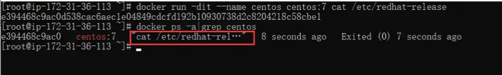
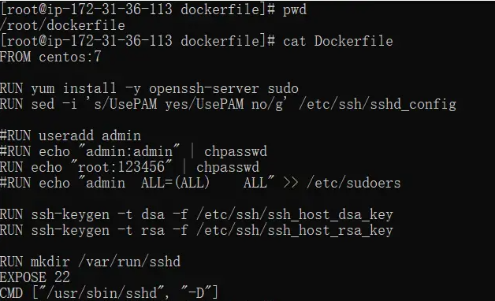
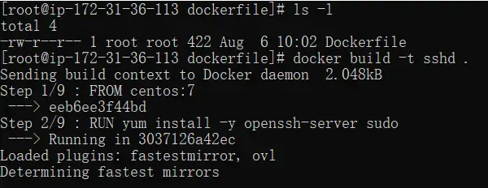

# 1.dockerfile参数详解
Dockerfile 由一行行命令语句组成，并且支持以 # 开头的注释行。
Dockerfile 基本的语法如下
使用 # 来注释

MAINTAINER 镜像作者信息
FROM 指令告诉 Docker 使用哪个镜像作为基础
RUN 开头的指令会在创建中运行，比如安装一个软件包，在这里使用 yum 来安装了一些软件
COPY 从 Docker 宿主机复制文件至创建的新镜像文件
ADD 类似于 COPY 指令，ADD 支持 tar 文件和 URL 路径
WORKDIR 用于为 Dockerfile 中所有的 RUN、CMD、ENTRYPOINT、COPY、ADD 指定设定工作目录
VOLUME 数据卷，用于在 image 中创建挂载点目录，以挂载 Docker host 上的卷或者其他容器上的卷
EXPOSE 为容器打开指定的监听端口以实现与外部通信
ENV 用于为镜像定义所需的环境变量，可以被 Dockerfile 文件中其他命令调用(ENV、ADD、COPY、RUN、CMD)
CMD 启动容器指定默认要运行的程序或命令，默认"/bin/sh -c"运行
ENTRYPOINT 类型 CMD 指令的功能，用于为容器指定默认运行程序或命令
USER 指定当前用户

## 1.1 FROM
格式为 FROM  或 FROM :TAG。
第一条指令必须为 FROM 指令。并且，如果在同一个Dockerfile中创建多个镜像时，可以使用多个 FROM 指令（每个镜像 一次）。
```shell
FROM centos:7
```
## 1.2 MAINTAINER
格式为 MAINTAINER <AUTHOR_NAME> ，指定维护者信息。
```shell
MAINTAINER FengLei
```
## 1.3 RUN
格式为:

RUN \
RUN ["executable", "param1", "param2"]

```shell
RUN yum -y install httpd
```

前者将在 shell 终端中运行命令，即 /bin/sh -c ；后者则使用 exec 执行。指定使用其它终端可以通过第二种方式实 现，例如 RUN ["/bin/bash", "-c", "echo Build_Dockerfile"] 。
每条 RUN 指令将在当前镜像基础上执行指定命令，并提交为新的镜像。当命令较长时可以使用 \ 来换行。
```shell
RUN yum clean all; \
yum install -y httpd; \
mkdir -p /var/www/html/;
```


### 1.4 COPY


COPY ... \
COPY ["",... ""]

和 RUN 指令一样，也有两种格式，一种类似于命令行，一种类似于函数调用。
复制本地主机的 .（为 Dockerfile 所在目录的相对路径）到容器中的。
当使用本地目录为源目录时，推荐使用 COPY 。
COPY 指令将从构建上下文目录中 <源路径> 的文件/目录复制到新的一层的镜像 内的 <目标路径> 位置。比如：
```shell
COPY index /usr/share/nginx/html
```

<源路径> 可以是多个，甚至可以是通配符，其通配符规则要满足 Go 的 filepath.Match 规则，如：
COPY /root/* /mnt/  \
COPY /root/*.html /usr/share/nginx/html/   \
<目标路径> 可以是容器内的绝对路径，也可以是相对于工作目录的相对路径（工 作目录可以用 WORKDIR 指令来指定）。目标路径不需要事先创建，如果目录不存 在会在复制文件前先行创建缺失目录。 此外，还需要注意一点，使用 COPY 指令，源文件的各种元数据都会保留。比如 读、写、执行权限、文件变更时间等。这个特性对于镜像定制很有用。特别是构建 相关文件都在使用 Git 进行管理的时候。
### 1.5 ADD
格式为 ADD 。
该命令将复制指定的 到容器中的 。
其中可以是Dockerfile所在目录的一个相对路径；也可以是 一个 URL；还可以是一个 tar 文件（自动解压为目录）。
```shell
FROM centos:7
ADD httpd-2.4.tar.gz /
```


### 1.6 WORKDIR
格式为 WORKDIR <Your_Work_Dir>
为后续的 RUN 、 CMD 、 ENTRYPOINT 指令配置工作目录。
可以使用多个 WORKDIR 指令，后续命令如果参数是相对路径，则会基于之前命令指定的路径。例如
```shell
WORKDIR /mnt/
WORKDIR dir1
WORKDIR dir2
```

最终路径为 /mnt/dir1/dir2
### 1.7 USER
格式为 USER <用户名> \
USER 指令和 WORKDIR 相似，都是改变环境状态并影响以后的层。 WORKDIR 是改变工作目录， USER 则是改变之后层的执行 RUN , CMD 以及 ENTRYPOINT 这类命令的身份。
注意: USER只是切换用户，该用户必须事先存在
```shell
RUN groupadd -r ug && useradd -r -g ug user1
USER user1
```


### 1.8 VOLUME
格式为 VOLUME ["/data"] 。
创建一个可以从本地主机或其他容器挂载的挂载点，一般用来存放数据库和需要保持的数据等。
### 1.9 EXPOSE
格式为 EXPOSE [...] 。
告诉 Docker 服务端容器暴露的端口号，供互联系统使用。
这只是一个声明，在运行时并不 会因为这个声明应用就会开启这个端口的服务。在 Dockerfile 中写入这样的声明有 两个好处，一个是帮助镜像使用者理解这个镜像服务的守护端口，以方便配置映 射；另一个用处则是在运行时使用随机端口映射时，也就是 docker run -P 时，会自动随机映射 EXPOSE 的端口。
```shell
FROM centos:7
EXPOSE 80,22
```


### 1.10 ENV
格式有两种：

ENV \
ENV =

这个指令就是设置环境变量，无论是后面的其它指令，如 RUN ，还是运行时的应用，都可以直接使用这里定义的环境变量。定义了环境变量，那么在后续的指令中，就可以使用这个环境变量。
这里的例子演示了定义MYSQL的用户和密码
```shell
ENV MYSQL_USER docker_user
ENV MYSQL_PASS docker_password
```
复制代码
### 1.11 CMD
支持三种格式，分别是:

CMD ["executable","param1","param2"] 使用 exec 执行（推荐）； \
CMD command param1 param2 在 /bin/sh 中执行，提供给需要交互的应用； \
CMD ["param1","param2"] 提供给 ENTRYPOINT 的默认参数； \

指定启动容器时执行的命令，每个 Dockerfile 只能有一条 CMD 命令。
如果指定了多条命令，只有最后一条会被执行。
如果用户启动容器时候指定了运行的命令，则会覆盖掉 CMD 指定的命令。
在运行时可以指定新的命令来替代镜像设置中的这个默认命令，比如， centos 镜像默认的 CMD 是 /bin/bash ，如果我们直接 docker run -it centos ,会直接进入 bash 。
也可以在运行时指定运行别的命令，如 docker run -it centos cat /etc/redhat-release。这就是用 cat /etc/redhat-release 命令替换了默认的 /bin/bash 命令\


在指令格式上，一般
推荐使用 exec 格式，这类格式在解析时会被解析为 JSON 数组，因此一定要使用双引号 " ，而不要使用单引号。
如果使用 shell 格式的话，实际的命令会被包装为 sh -c 的参数的形式进行 执行。比如：
CMD echo USERNAME在实际执行中，会将其变更为：CMD["sh","−c","echoUSERNAME在实际执行中，会将其变更为： CMD [ "sh", "-c", "echo USERNAME在实际执行中，会将其变更为：CMD["sh","−c","echoUSERNAME" ]

```shell
CMD [ "sh", "-c", "echo $USERNAME" ]
```
这就是为什么我们可以使用环境变量的原因，因为这些环境变量会被 shell 进行解 析处理。 提到 CMD 就不得不提容器中应用在前台执行和后台执行的问题。这是初学者常出 现的一个混淆。
### 1.12 ENTRYPOINT
ENTRYPOINT 成为 入口点
ENTRYPOINT 的格式和 RUN 指令格式一样，分为 exec 格式和 shell 格 式。
拥有两种格式：

ENTRYPOINT ["executable", "param1", "param2"] \
ENTRYPOINT command param1 param2 （shell中执行）。 \

配置容器启动后执行的命令，并且不可被 docker run 提供的参数覆盖。 每个 Dockerfile 中只能有一个 ENTRYPOINT ，当指定多个时，只有最后一个起效。 \
ENTRYPOINT 的目的和 CMD 一样，都是在指定容器启动程序及参 数。 ENTRYPOINT 在运行时也可以替代，不过比 CMD 要略显繁琐，需要通过 docker run 的参数 --entrypoint 来指定。 当指定了 ENTRYPOINT 后， CMD 的含义就发生了改变，不再是直接的运行其命令，而是将 CMD 的内容作为参数传给 ENTRYPOINT 指令，换句话说实际执行 时，将变为： \
"CMD"

2.用dockerfile构建镜像 \
这一步在前面的基础入门讲到过，只是简单的示例，那么在这一章中，经过前面一小节的学习，你应该对dockefile有一个基础的认识
centos-7 镜像为基础镜像,安装openssh-server服务，暴露端口 22，容器开机运行 sshd
```shell


FROM centos:7

RUN yum install -y openssh-server sudo
RUN sed -i 's/UsePAM yes/UsePAM no/g' /etc/ssh/sshd_config

RUN echo "root:123456" | chpasswd

RUN ssh-keygen -t dsa -f /etc/ssh/ssh_host_dsa_key
RUN ssh-keygen -t rsa -f /etc/ssh/ssh_host_rsa_key

RUN mkdir /var/run/sshd
EXPOSE 22
CMD ["/usr/sbin/sshd", "-D"]

```

Dockerfile 后可以使用 docker build 来生成镜像。 \
其中 -t 标记来添加 tag，指定新的镜像的用户信息。 \
“.” 是 Dockerfile 所在的路径（当前目录），也可以替换为一个具体的 Dockerfile 的路径\

