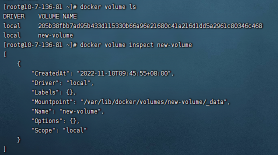

## 1.什么是supermin
Supermin是用于构建Supermin设备的工具。这些是小型设备（类似于虚拟机），通常大小约为100KB，当您需要启动其中一个设备时，它们会在短短几秒钟内完全实例化。
### 1.1 基本操作
supermin工具可以在两种模式下使用，准备一个小型的supermin设备，这是在构建系统上完成的。以及building，它使用supermin设备并构建一个完整的可引导设备，这是在最终用户的系统上完成的。
Supermin不需要以root身份运行，通常不应以root身份进行运行。它不会影响主机系统或主机系统上安装的软件包。
### 1.2 准备模式
--prepare在给定的输出目录中创建了一个小的supermin设备。你给它一个你想要安装的软件包的列表，supermin会自动找到依赖项。必须在主机上安装软件包列表。
```shell
supermin --prepare bash coreutils -o supermin.d
```
### 1.3 构建模式
--build（以前是一个名为“supermin helper”的单独程序）从supermin设备构建整个设备:
```shell
supermin --build --format ext2 supermin.d -o appliance.d
```
### 1.4 构建和缓存
通常，您希望仅根据需要在最终用户计算机上重建设备。Supermin有一些额外的选项来简化此操作：
```shell
supermin --build \
--if-newer --lock /run/user/`id -u`/supermin.lock \
--format ext2 supermin.d -o appliance.d
````

## 2.使用supermin5来构建一个基础镜像
在这个案例中，我将使用 supermin5 命令构建 centos7系统的 docker 镜像，镜像名称为 centos-7，镜像预装 yum、net-tools、initscripts 和 vi 命令
```shell

# 安装supermin
yum -y install supermin*

# supermin5 添加预装工具 yum net-tools initscripts vi
supermin5 -v --prepare bash coreutils  yum  net-tools initscripts vim-minial  -o supermin.d
# supermin5 构建
supermin5 -v --build --format chroot supermin.d -o appliance.d

echo 7 >  appliance.d/etc/yum/vars/releasever
# 镜像打包
tar --numeric-owner -cpf centos-7.tar -C appliance.d .

# 导入镜像
cat centos-7.tar | docker import - centos-7
# 运行
docker run -dit --name centos7 centos-7 /bin/bash
cat /etc/redhat-release

```


在容器中管理数据主要有两种方式：

- 数据卷（Data volumes）
- 数据卷容器（Data volume containers）
#  1.数据卷
##  1.1 什么是数据卷？
  数据卷是一个可供一个或多个容器使用的特殊目录，它绕过 UFS，可以提供很多有用的特性：

* 数据卷可以在容器之间共享和重用
* 对数据卷的修改会立马生效
* 对数据卷的更新，不会影响镜像
* 卷会一直存在，直到没有容器使用

数据卷的使用，类似于 Linux 下对目录或文件进行 mount。
## 1.2 创建数据卷
```shell
# 创建一个名为 new-volume 的数据卷
docker volume create new-volume
# 列出
docker volume ls

# 查看卷信息
docker volume inspect new-volume
```

## 1.3 挂载数据卷
```shell
# 启动一个挂载新卷的nginx容器
docker run -dit --name nginx -v new-volume:/mnt nginx

# 查看容器的详细信息 grep -a 这里显示具体前后行数
 docker inspect nginx|grep Mounts -a5
```
## 1.4 删除数据卷
数据卷 是被设计用来持久化数据的，它的生命周期独立于容器，Docker 不会在 容器被删除后自动删除 数据卷 ，并且也不存在垃圾回收这样的机制来处理没有任 何容器引用的 数据卷 。如果需要在删除容器的同时移除数据卷。可以在删除容器 的时候使用 `docker rm -v `这个命令。

```shell
docker volume rm new-volume
```
无主的数据卷可能会占据很多空间，要清理请使用以下命令

```shell
docker volume prune
```

# 2.数据卷容器
## 2.1 什么是数据卷容器？
数据卷容器，其实就是一个正常的容器，专门用来提供数据卷供其它容器挂载的。
## 2.1、容器间共享卷
在这个案例中，将使用三个nginx容器进行演示，分别为 nginxweb1、nginxweb2、nginxweb3
```shell


# 启动nginxweb1 创建共享卷
docker run -dit --name nginxweb1 -p 8081:80 -v /usr/share/nginx/html nginx
# 启动nginxweb2、nginxweb3 并指定共享卷为 nginxweb1
docker run -dit --name nginxweb2 --volumes-from nginxweb1 -p 8082:80 nginx
docker run -dit --name nginxweb3 --volumes-from nginxweb1 -p 8083:80 nginx
# curl测试
curl localhost:8081
curl localhost:8082
curl localhost:8083
# 进入nginxweb1 进行修改index.html文件，并测试
docker exec -it nginxweb1 bash
容器内操作
echo "This is nginxweb1 website" > /usr/share/nginx/html/index.html
# 退出容器测试 exit
curl localhost:8081
curl localhost:8082
curl localhost:8083

```