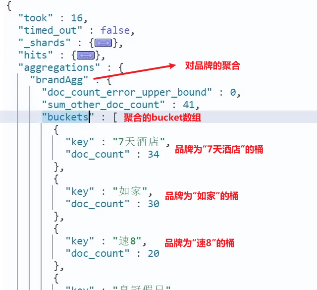
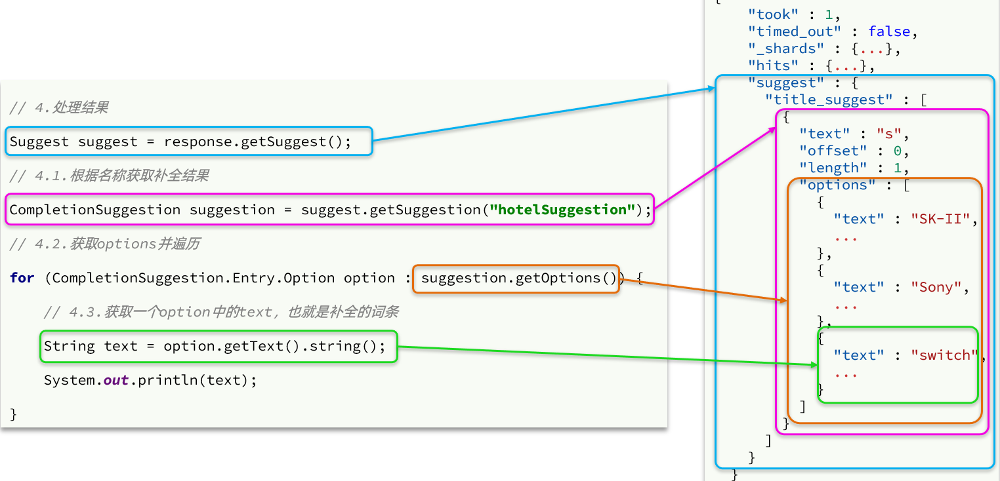
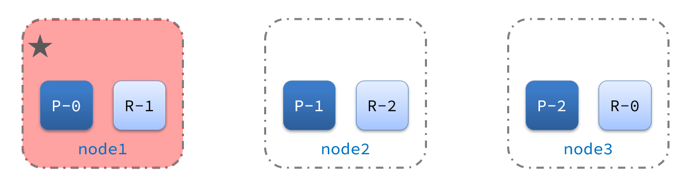

```
此资源由 58学课资源站 收集整理
想要获取完整课件资料 请访问：58xueke.com
百万资源 畅享学习
```
# 分布式搜索引擎03



# 0.学习目标



# 1.数据聚合

**[聚合（](https://www.elastic.co/guide/en/elasticsearch/reference/current/search-aggregations.html)[aggregations](https://www.elastic.co/guide/en/elasticsearch/reference/current/search-aggregations.html)[）](https://www.elastic.co/guide/en/elasticsearch/reference/current/search-aggregations.html)**可以让我们极其方便的实现对数据的统计、分析、运算。例如：

- 什么品牌的手机最受欢迎？
- 这些手机的平均价格、最高价格、最低价格？
- 这些手机每月的销售情况如何？

实现这些统计功能的比数据库的sql要方便的多，而且查询速度非常快，可以实现近实时搜索效果。

## 1.1.聚合的种类

聚合常见的有三类：

- **桶（Bucket）**聚合：用来对文档做分组
  - TermAggregation：按照文档字段值分组，例如按照品牌值分组、按照国家分组
  - Date Histogram：按照日期阶梯分组，例如一周为一组，或者一月为一组

- **度量（Metric）**聚合：用以计算一些值，比如：最大值、最小值、平均值等
  - Avg：求平均值
  - Max：求最大值
  - Min：求最小值
  - Stats：同时求max、min、avg、sum等
- **管道（pipeline）**聚合：其它聚合的结果为基础做聚合



> **注意：**参加聚合的字段必须是keyword、日期、数值、布尔类型





## 1.2.DSL实现聚合

现在，我们要统计所有数据中的酒店品牌有几种，其实就是按照品牌对数据分组。此时可以根据酒店品牌的名称做聚合，也就是Bucket聚合。

### 1.2.1.Bucket聚合语法

语法如下：

```json
GET /hotel/_search
{
  "size": 0,  // 设置size为0，结果中不包含文档，只包含聚合结果
  "aggs": { // 定义聚合
    "brandAgg": { //给聚合起个名字
      "terms": { // 聚合的类型，按照品牌值聚合，所以选择term
        "field": "brand", // 参与聚合的字段
        "size": 20 // 希望获取的聚合结果数量
      }
    }
  }
}
```

结果如图：





### 1.2.2.聚合结果排序

默认情况下，Bucket聚合会统计Bucket内的文档数量，记为_count，并且按照_count降序排序。

我们可以指定order属性，自定义聚合的排序方式：

```json
GET /hotel/_search
{
  "size": 0, 
  "aggs": {
    "brandAgg": {
      "terms": {
        "field": "brand",
        "order": {
          "_count": "asc" // 按照_count升序排列
        },
        "size": 20
      }
    }
  }
}
```



### 1.2.3.限定聚合范围

默认情况下，Bucket聚合是对索引库的所有文档做聚合，但真实场景下，用户会输入搜索条件，因此聚合必须是对搜索结果聚合。那么聚合必须添加限定条件。

我们可以限定要聚合的文档范围，只要添加query条件即可：

```json
GET /hotel/_search
{
  "query": {
    "range": {
      "price": {
        "lte": 200 // 只对200元以下的文档聚合
      }
    }
  }, 
  "size": 0, 
  "aggs": {
    "brandAgg": {
      "terms": {
        "field": "brand",
        "size": 20
      }
    }
  }
}
```



这次，聚合得到的品牌明显变少了：





### 1.2.4.Metric聚合语法

上节课，我们对酒店按照品牌分组，形成了一个个桶。现在我们需要对桶内的酒店做运算，获取每个品牌的用户评分的min、max、avg等值。

这就要用到Metric聚合了，例如stat聚合：就可以获取min、max、avg等结果。

语法如下：

```json
GET /hotel/_search
{
  "size": 0, 
  "aggs": {
    "brandAgg": { 
      "terms": { 
        "field": "brand", 
        "size": 20
      },
      "aggs": { // 是brands聚合的子聚合，也就是分组后对每组分别计算
        "score_stats": { // 聚合名称
          "stats": { // 聚合类型，这里stats可以计算min、max、avg等
            "field": "score" // 聚合字段，这里是score
          }
        }
      }
    }
  }
}
```



这次的score_stats聚合是在brandAgg的聚合内部嵌套的子聚合。因为我们需要在每个桶分别计算。



另外，我们还可以给聚合结果做个排序，例如按照每个桶的酒店平均分做排序：







### 1.2.5.小结

aggs代表聚合，与query同级，此时query的作用是？

- 限定聚合的的文档范围

聚合必须的三要素：

- 聚合名称
- 聚合类型
- 聚合字段

聚合可配置属性有：

- size：指定聚合结果数量
- order：指定聚合结果排序方式
- field：指定聚合字段



## 1.3.RestAPI实现聚合

### 1.3.1.API语法

聚合条件与query条件同级别，因此需要使用request.source()来指定聚合条件。

聚合条件的语法：





聚合的结果也与查询结果不同，API也比较特殊。不过同样是JSON逐层解析：





### 1.3.2.业务需求

需求：搜索页面的品牌、城市等信息不应该是在页面写死，而是通过聚合索引库中的酒店数据得来的：





分析：

目前，页面的城市列表、星级列表、品牌列表都是写死的，并不会随着搜索结果的变化而变化。但是用户搜索条件改变时，搜索结果会跟着变化。

例如：用户搜索“东方明珠”，那搜索的酒店肯定是在上海东方明珠附近，因此，城市只能是上海，此时城市列表中就不应该显示北京、深圳、杭州这些信息了。



也就是说，搜索结果中包含哪些城市，页面就应该列出哪些城市；搜索结果中包含哪些品牌，页面就应该列出哪些品牌。

如何得知搜索结果中包含哪些品牌？如何得知搜索结果中包含哪些城市？



使用聚合功能，利用Bucket聚合，对搜索结果中的文档基于品牌分组、基于城市分组，就能得知包含哪些品牌、哪些城市了。

因为是对搜索结果聚合，因此聚合是**限定范围的聚合**，也就是说聚合的限定条件跟搜索文档的条件一致。



查看浏览器可以发现，前端其实已经发出了这样的一个请求：



请求**参数与搜索文档的参数完全一致**。



返回值类型就是页面要展示的最终结果：



结果是一个Map结构：

- key是字符串，城市、星级、品牌、价格
- value是集合，例如多个城市的名称



### 1.3.3.业务实现

在`cn.itcast.hotel.web`包的`HotelController`中添加一个方法，遵循下面的要求：

- 请求方式：`POST`
- 请求路径：`/hotel/filters`
- 请求参数：`RequestParams`，与搜索文档的参数一致
- 返回值类型：`Map<String, List<String>>`

代码：

```java
    @PostMapping("filters")
    public Map<String, List<String>> getFilters(@RequestBody RequestParams params){
        return hotelService.getFilters(params);
    }
```



这里调用了IHotelService中的getFilters方法，尚未实现。

在`cn.itcast.hotel.service.IHotelService`中定义新方法：

```java
Map<String, List<String>> filters(RequestParams params);
```



在`cn.itcast.hotel.service.impl.HotelService`中实现该方法：

```java
@Override
public Map<String, List<String>> filters(RequestParams params) {
    try {
        // 1.准备Request
        SearchRequest request = new SearchRequest("hotel");
        // 2.准备DSL
        // 2.1.query
        buildBasicQuery(params, request);
        // 2.2.设置size
        request.source().size(0);
        // 2.3.聚合
        buildAggregation(request);
        // 3.发出请求
        SearchResponse response = client.search(request, RequestOptions.DEFAULT);
        // 4.解析结果
        Map<String, List<String>> result = new HashMap<>();
        Aggregations aggregations = response.getAggregations();
        // 4.1.根据品牌名称，获取品牌结果
        List<String> brandList = getAggByName(aggregations, "brandAgg");
        result.put("品牌", brandList);
        // 4.2.根据品牌名称，获取品牌结果
        List<String> cityList = getAggByName(aggregations, "cityAgg");
        result.put("城市", cityList);
        // 4.3.根据品牌名称，获取品牌结果
        List<String> starList = getAggByName(aggregations, "starAgg");
        result.put("星级", starList);

        return result;
    } catch (IOException e) {
        throw new RuntimeException(e);
    }
}

private void buildAggregation(SearchRequest request) {
    request.source().aggregation(AggregationBuilders
                                 .terms("brandAgg")
                                 .field("brand")
                                 .size(100)
                                );
    request.source().aggregation(AggregationBuilders
                                 .terms("cityAgg")
                                 .field("city")
                                 .size(100)
                                );
    request.source().aggregation(AggregationBuilders
                                 .terms("starAgg")
                                 .field("starName")
                                 .size(100)
                                );
}

private List<String> getAggByName(Aggregations aggregations, String aggName) {
    // 4.1.根据聚合名称获取聚合结果
    Terms brandTerms = aggregations.get(aggName);
    // 4.2.获取buckets
    List<? extends Terms.Bucket> buckets = brandTerms.getBuckets();
    // 4.3.遍历
    List<String> brandList = new ArrayList<>();
    for (Terms.Bucket bucket : buckets) {
        // 4.4.获取key
        String key = bucket.getKeyAsString();
        brandList.add(key);
    }
    return brandList;
}
```







# 2.自动补全

当用户在搜索框输入字符时，我们应该提示出与该字符有关的搜索项，如图：



这种根据用户输入的字母，提示完整词条的功能，就是自动补全了。



因为需要根据拼音字母来推断，因此要用到拼音分词功能。



## 2.1.拼音分词器



要实现根据字母做补全，就必须对文档按照拼音分词。在GitHub上恰好有elasticsearch的拼音分词插件。地址：https://github.com/medcl/elasticsearch-analysis-pinyin







课前资料中也提供了拼音分词器的安装包：

 



安装方式与IK分词器一样，分三步：

​	①解压

​	②上传到虚拟机中，elasticsearch的plugin目录

​	③重启elasticsearch

​	④测试



详细安装步骤可以参考IK分词器的安装过程。





测试用法如下：

```json
POST /_analyze
{
  "text": "如家酒店还不错",
  "analyzer": "pinyin"
}
```

结果：

 





## 2.2.自定义分词器

默认的拼音分词器会将每个汉字单独分为拼音，而我们希望的是每个词条形成一组拼音，需要对拼音分词器做个性化定制，形成自定义分词器。



elasticsearch中分词器（analyzer）的组成包含三部分：

- character filters：在tokenizer之前对文本进行处理。例如删除字符、替换字符
- tokenizer：将文本按照一定的规则切割成词条（term）。例如keyword，就是不分词；还有ik_smart
- tokenizer filter：将tokenizer输出的词条做进一步处理。例如大小写转换、同义词处理、拼音处理等



文档分词时会依次由这三部分来处理文档：

   

声明自定义分词器的语法如下：

```json
PUT /test
{
  "settings": {
    "analysis": {
      "analyzer": { // 自定义分词器
        "my_analyzer": {  // 分词器名称
          "tokenizer": "ik_max_word",
          "filter": "py"
        }
      },
      "filter": { // 自定义tokenizer filter
        "py": { // 过滤器名称
          "type": "pinyin", // 过滤器类型，这里是pinyin
		  "keep_full_pinyin": false,
          "keep_joined_full_pinyin": true,
          "keep_original": true,
          "limit_first_letter_length": 16,
          "remove_duplicated_term": true,
          "none_chinese_pinyin_tokenize": false
        }
      }
    }
  },
  "mappings": {
    "properties": {
      "name": {
        "type": "text",
        "analyzer": "my_analyzer",
        "search_analyzer": "ik_smart"
      }
    }
  }
}
```



测试：







总结：

如何使用拼音分词器？

- ①下载pinyin分词器

- ②解压并放到elasticsearch的plugin目录

- ③重启即可

如何自定义分词器？

- ①创建索引库时，在settings中配置，可以包含三部分

- ②character filter

- ③tokenizer

- ④filter

拼音分词器注意事项？

- 为了避免搜索到同音字，搜索时不要使用拼音分词器





## 2.3.自动补全查询

elasticsearch提供了[Completion Suggester](https://www.elastic.co/guide/en/elasticsearch/reference/7.6/search-suggesters.html)查询来实现自动补全功能。这个查询会匹配以用户输入内容开头的词条并返回。为了提高补全查询的效率，对于文档中字段的类型有一些约束：

- 参与补全查询的字段必须是completion类型。

- 字段的内容一般是用来补全的多个词条形成的数组。

比如，一个这样的索引库：

```json
// 创建索引库
PUT test
{
  "mappings": {
    "properties": {
      "title":{
        "type": "completion"
      }
    }
  }
}
```

然后插入下面的数据：

```json
// 示例数据
POST test/_doc
{
  "title": ["Sony", "WH-1000XM3"]
}
POST test/_doc
{
  "title": ["SK-II", "PITERA"]
}
POST test/_doc
{
  "title": ["Nintendo", "switch"]
}
```



查询的DSL语句如下：

```json
// 自动补全查询
GET /test/_search
{
  "suggest": {
    "title_suggest": {
      "text": "s", // 关键字
      "completion": {
        "field": "title", // 补全查询的字段
        "skip_duplicates": true, // 跳过重复的
        "size": 10 // 获取前10条结果
      }
    }
  }
}
```







## 2.4.实现酒店搜索框自动补全

现在，我们的hotel索引库还没有设置拼音分词器，需要修改索引库中的配置。但是我们知道索引库是无法修改的，只能删除然后重新创建。

另外，我们需要添加一个字段，用来做自动补全，将brand、suggestion、city等都放进去，作为自动补全的提示。



因此，总结一下，我们需要做的事情包括：

1. 修改hotel索引库结构，设置自定义拼音分词器

2. 修改索引库的name、all字段，使用自定义分词器

3. 索引库添加一个新字段suggestion，类型为completion类型，使用自定义的分词器

4. 给HotelDoc类添加suggestion字段，内容包含brand、business

5. 重新导入数据到hotel库



### 2.4.1.修改酒店映射结构

代码如下：

```json
// 酒店数据索引库
PUT /hotel
{
  "settings": {
    "analysis": {
      "analyzer": {
        "text_anlyzer": {
          "tokenizer": "ik_max_word",
          "filter": "py"
        },
        "completion_analyzer": {
          "tokenizer": "keyword",
          "filter": "py"
        }
      },
      "filter": {
        "py": {
          "type": "pinyin",
          "keep_full_pinyin": false,
          "keep_joined_full_pinyin": true,
          "keep_original": true,
          "limit_first_letter_length": 16,
          "remove_duplicated_term": true,
          "none_chinese_pinyin_tokenize": false
        }
      }
    }
  },
  "mappings": {
    "properties": {
      "id":{
        "type": "keyword"
      },
      "name":{
        "type": "text",
        "analyzer": "text_anlyzer",
        "search_analyzer": "ik_smart",
        "copy_to": "all"
      },
      "address":{
        "type": "keyword",
        "index": false
      },
      "price":{
        "type": "integer"
      },
      "score":{
        "type": "integer"
      },
      "brand":{
        "type": "keyword",
        "copy_to": "all"
      },
      "city":{
        "type": "keyword"
      },
      "starName":{
        "type": "keyword"
      },
      "business":{
        "type": "keyword",
        "copy_to": "all"
      },
      "location":{
        "type": "geo_point"
      },
      "pic":{
        "type": "keyword",
        "index": false
      },
      "all":{
        "type": "text",
        "analyzer": "text_anlyzer",
        "search_analyzer": "ik_smart"
      },
      "suggestion":{
          "type": "completion",
          "analyzer": "completion_analyzer"
      }
    }
  }
}
```



### 2.4.2.修改HotelDoc实体

HotelDoc中要添加一个字段，用来做自动补全，内容可以是酒店品牌、城市、商圈等信息。按照自动补全字段的要求，最好是这些字段的数组。

因此我们在HotelDoc中添加一个suggestion字段，类型为`List<String>`，然后将brand、city、business等信息放到里面。

代码如下：

```java
package cn.itcast.hotel.pojo;

import lombok.Data;
import lombok.NoArgsConstructor;

import java.util.ArrayList;
import java.util.Arrays;
import java.util.Collections;
import java.util.List;

@Data
@NoArgsConstructor
public class HotelDoc {
    private Long id;
    private String name;
    private String address;
    private Integer price;
    private Integer score;
    private String brand;
    private String city;
    private String starName;
    private String business;
    private String location;
    private String pic;
    private Object distance;
    private Boolean isAD;
    private List<String> suggestion;

    public HotelDoc(Hotel hotel) {
        this.id = hotel.getId();
        this.name = hotel.getName();
        this.address = hotel.getAddress();
        this.price = hotel.getPrice();
        this.score = hotel.getScore();
        this.brand = hotel.getBrand();
        this.city = hotel.getCity();
        this.starName = hotel.getStarName();
        this.business = hotel.getBusiness();
        this.location = hotel.getLatitude() + ", " + hotel.getLongitude();
        this.pic = hotel.getPic();
        // 组装suggestion
        if(this.business.contains("/")){
            // business有多个值，需要切割
            String[] arr = this.business.split("/");
            // 添加元素
            this.suggestion = new ArrayList<>();
            this.suggestion.add(this.brand);
            Collections.addAll(this.suggestion, arr);
        }else {
            this.suggestion = Arrays.asList(this.brand, this.business);
        }
    }
}
```



### 2.4.3.重新导入

重新执行之前编写的导入数据功能，可以看到新的酒店数据中包含了suggestion：







### 2.4.4.自动补全查询的JavaAPI

之前我们学习了自动补全查询的DSL，而没有学习对应的JavaAPI，这里给出一个示例：





而自动补全的结果也比较特殊，解析的代码如下：





### 2.4.5.实现搜索框自动补全

查看前端页面，可以发现当我们在输入框键入时，前端会发起ajax请求：



返回值是补全词条的集合，类型为`List<String>`



1）在`cn.itcast.hotel.web`包下的`HotelController`中添加新接口，接收新的请求：

```java
@GetMapping("suggestion")
public List<String> getSuggestions(@RequestParam("key") String prefix) {
    return hotelService.getSuggestions(prefix);
}
```



2）在`cn.itcast.hotel.service`包下的`IhotelService`中添加方法：

```java
List<String> getSuggestions(String prefix);
```



3）在`cn.itcast.hotel.service.impl.HotelService`中实现该方法：

```java
@Override
public List<String> getSuggestions(String prefix) {
    try {
        // 1.准备Request
        SearchRequest request = new SearchRequest("hotel");
        // 2.准备DSL
        request.source().suggest(new SuggestBuilder().addSuggestion(
            "suggestions",
            SuggestBuilders.completionSuggestion("suggestion")
            .prefix(prefix)
            .skipDuplicates(true)
            .size(10)
        ));
        // 3.发起请求
        SearchResponse response = client.search(request, RequestOptions.DEFAULT);
        // 4.解析结果
        Suggest suggest = response.getSuggest();
        // 4.1.根据补全查询名称，获取补全结果
        CompletionSuggestion suggestions = suggest.getSuggestion("suggestions");
        // 4.2.获取options
        List<CompletionSuggestion.Entry.Option> options = suggestions.getOptions();
        // 4.3.遍历
        List<String> list = new ArrayList<>(options.size());
        for (CompletionSuggestion.Entry.Option option : options) {
            String text = option.getText().toString();
            list.add(text);
        }
        return list;
    } catch (IOException e) {
        throw new RuntimeException(e);
    }
}
```





# 3.数据同步

elasticsearch中的酒店数据来自于mysql数据库，因此mysql数据发生改变时，elasticsearch也必须跟着改变，这个就是elasticsearch与mysql之间的**数据同步**。









## 3.1.思路分析

常见的数据同步方案有三种：

- 同步调用
- 异步通知
- 监听binlog



### 3.1.1.同步调用

方案一：同步调用



基本步骤如下：

- hotel-demo对外提供接口，用来修改elasticsearch中的数据
- 酒店管理服务在完成数据库操作后，直接调用hotel-demo提供的接口，



### 3.1.2.异步通知

方案二：异步通知





流程如下：

- hotel-admin对mysql数据库数据完成增、删、改后，发送MQ消息
- hotel-demo监听MQ，接收到消息后完成elasticsearch数据修改





### 3.1.3.监听binlog

方案三：监听binlog



流程如下：

- 给mysql开启binlog功能
- mysql完成增、删、改操作都会记录在binlog中
- hotel-demo基于canal监听binlog变化，实时更新elasticsearch中的内容



### 3.1.4.选择

方式一：同步调用

- 优点：实现简单，粗暴
- 缺点：业务耦合度高

方式二：异步通知

- 优点：低耦合，实现难度一般
- 缺点：依赖mq的可靠性

方式三：监听binlog

- 优点：完全解除服务间耦合
- 缺点：开启binlog增加数据库负担、实现复杂度高



## 3.2.实现数据同步



### 3.2.1.思路

利用课前资料提供的hotel-admin项目作为酒店管理的微服务。当酒店数据发生增、删、改时，要求对elasticsearch中数据也要完成相同操作。

步骤：

- 导入课前资料提供的hotel-admin项目，启动并测试酒店数据的CRUD

- 声明exchange、queue、RoutingKey

- 在hotel-admin中的增、删、改业务中完成消息发送

- 在hotel-demo中完成消息监听，并更新elasticsearch中数据

- 启动并测试数据同步功能









### 3.2.2.导入demo

导入课前资料提供的hotel-admin项目：



运行后，访问 http://localhost:8099





其中包含了酒店的CRUD功能：





### 3.2.3.声明交换机、队列

MQ结构如图：





#### 1）引入依赖

在hotel-admin、hotel-demo中引入rabbitmq的依赖：

```xml
<!--amqp-->
<dependency>
    <groupId>org.springframework.boot</groupId>
    <artifactId>spring-boot-starter-amqp</artifactId>
</dependency>
```



#### 2）声明队列交换机名称

在hotel-admin和hotel-demo中的`cn.itcast.hotel.constatnts`包下新建一个类`MqConstants`：

```java
package cn.itcast.hotel.constatnts;

    public class MqConstants {
    /**
     * 交换机
     */
    public final static String HOTEL_EXCHANGE = "hotel.topic";
    /**
     * 监听新增和修改的队列
     */
    public final static String HOTEL_INSERT_QUEUE = "hotel.insert.queue";
    /**
     * 监听删除的队列
     */
    public final static String HOTEL_DELETE_QUEUE = "hotel.delete.queue";
    /**
     * 新增或修改的RoutingKey
     */
    public final static String HOTEL_INSERT_KEY = "hotel.insert";
    /**
     * 删除的RoutingKey
     */
    public final static String HOTEL_DELETE_KEY = "hotel.delete";
}
```



#### 3）声明队列交换机

在hotel-demo中，定义配置类，声明队列、交换机：

```java
package cn.itcast.hotel.config;

import cn.itcast.hotel.constants.MqConstants;
import org.springframework.amqp.core.Binding;
import org.springframework.amqp.core.BindingBuilder;
import org.springframework.amqp.core.Queue;
import org.springframework.amqp.core.TopicExchange;
import org.springframework.context.annotation.Bean;
import org.springframework.context.annotation.Configuration;

@Configuration
public class MqConfig {
    @Bean
    public TopicExchange topicExchange(){
        return new TopicExchange(MqConstants.HOTEL_EXCHANGE, true, false);
    }

    @Bean
    public Queue insertQueue(){
        return new Queue(MqConstants.HOTEL_INSERT_QUEUE, true);
    }

    @Bean
    public Queue deleteQueue(){
        return new Queue(MqConstants.HOTEL_DELETE_QUEUE, true);
    }

    @Bean
    public Binding insertQueueBinding(){
        return BindingBuilder.bind(insertQueue()).to(topicExchange()).with(MqConstants.HOTEL_INSERT_KEY);
    }

    @Bean
    public Binding deleteQueueBinding(){
        return BindingBuilder.bind(deleteQueue()).to(topicExchange()).with(MqConstants.HOTEL_DELETE_KEY);
    }
}
```



### 3.2.4.发送MQ消息

在hotel-admin中的增、删、改业务中分别发送MQ消息：





### 3.2.5.接收MQ消息

hotel-demo接收到MQ消息要做的事情包括：

- 新增消息：根据传递的hotel的id查询hotel信息，然后新增一条数据到索引库
- 删除消息：根据传递的hotel的id删除索引库中的一条数据



1）首先在hotel-demo的`cn.itcast.hotel.service`包下的`IHotelService`中新增新增、删除业务

```java
void deleteById(Long id);

void insertById(Long id);
```



2）给hotel-demo中的`cn.itcast.hotel.service.impl`包下的HotelService中实现业务：

```java
@Override
public void deleteById(Long id) {
    try {
        // 1.准备Request
        DeleteRequest request = new DeleteRequest("hotel", id.toString());
        // 2.发送请求
        client.delete(request, RequestOptions.DEFAULT);
    } catch (IOException e) {
        throw new RuntimeException(e);
    }
}

@Override
public void insertById(Long id) {
    try {
        // 0.根据id查询酒店数据
        Hotel hotel = getById(id);
        // 转换为文档类型
        HotelDoc hotelDoc = new HotelDoc(hotel);

        // 1.准备Request对象
        IndexRequest request = new IndexRequest("hotel").id(hotel.getId().toString());
        // 2.准备Json文档
        request.source(JSON.toJSONString(hotelDoc), XContentType.JSON);
        // 3.发送请求
        client.index(request, RequestOptions.DEFAULT);
    } catch (IOException e) {
        throw new RuntimeException(e);
    }
}
```



3）编写监听器

在hotel-demo中的`cn.itcast.hotel.mq`包新增一个类：

```java
package cn.itcast.hotel.mq;

import cn.itcast.hotel.constants.MqConstants;
import cn.itcast.hotel.service.IHotelService;
import org.springframework.amqp.rabbit.annotation.RabbitListener;
import org.springframework.beans.factory.annotation.Autowired;
import org.springframework.stereotype.Component;

@Component
public class HotelListener {

    @Autowired
    private IHotelService hotelService;

    /**
     * 监听酒店新增或修改的业务
     * @param id 酒店id
     */
    @RabbitListener(queues = MqConstants.HOTEL_INSERT_QUEUE)
    public void listenHotelInsertOrUpdate(Long id){
        hotelService.insertById(id);
    }

    /**
     * 监听酒店删除的业务
     * @param id 酒店id
     */
    @RabbitListener(queues = MqConstants.HOTEL_DELETE_QUEUE)
    public void listenHotelDelete(Long id){
        hotelService.deleteById(id);
    }
}
```





# 4.集群

单机的elasticsearch做数据存储，必然面临两个问题：海量数据存储问题、单点故障问题。

- 海量数据存储问题：将索引库从逻辑上拆分为N个分片（shard），存储到多个节点
- 单点故障问题：将分片数据在不同节点备份（replica ）

**ES集群相关概念**:

* 集群（cluster）：一组拥有共同的 cluster name 的 节点。

* <font color="red">节点（node)</font>   ：集群中的一个 Elasticearch 实例

* <font color="red">分片（shard）</font>：索引可以被拆分为不同的部分进行存储，称为分片。在集群环境下，一个索引的不同分片可以拆分到不同的节点中

  解决问题：数据量太大，单点存储量有限的问题。

  

  > 此处，我们把数据分成3片：shard0、shard1、shard2

* 主分片（Primary shard）：相对于副本分片的定义。

* 副本分片（Replica shard）每个主分片可以有一个或者多个副本，数据和主分片一样。

  ​	

数据备份可以保证高可用，但是每个分片备份一份，所需要的节点数量就会翻一倍，成本实在是太高了！

为了在高可用和成本间寻求平衡，我们可以这样做：

- 首先对数据分片，存储到不同节点
- 然后对每个分片进行备份，放到对方节点，完成互相备份

这样可以大大减少所需要的服务节点数量，如图，我们以3分片，每个分片备份一份为例：



现在，每个分片都有1个备份，存储在3个节点：

- node0：保存了分片0和1
- node1：保存了分片0和2
- node2：保存了分片1和2





## 4.1.搭建ES集群

参考课前资料的文档：

 

其中的第四章节：

 









## 4.2.集群脑裂问题



### 4.2.1.集群职责划分

elasticsearch中集群节点有不同的职责划分：





默认情况下，集群中的任何一个节点都同时具备上述四种角色。



但是真实的集群一定要将集群职责分离：

- master节点：对CPU要求高，但是内存要求第
- data节点：对CPU和内存要求都高
- coordinating节点：对网络带宽、CPU要求高

职责分离可以让我们根据不同节点的需求分配不同的硬件去部署。而且避免业务之间的互相干扰。

一个典型的es集群职责划分如图：





### 4.2.2.脑裂问题

脑裂是因为集群中的节点失联导致的。

例如一个集群中，主节点与其它节点失联：



此时，node2和node3认为node1宕机，就会重新选主：



当node3当选后，集群继续对外提供服务，node2和node3自成集群，node1自成集群，两个集群数据不同步，出现数据差异。

当网络恢复后，因为集群中有两个master节点，集群状态的不一致，出现脑裂的情况：





解决脑裂的方案是，要求选票超过 ( eligible节点数量 + 1 ）/ 2 才能当选为主，因此eligible节点数量最好是奇数。对应配置项是discovery.zen.minimum_master_nodes，在es7.0以后，已经成为默认配置，因此一般不会发生脑裂问题



例如：3个节点形成的集群，选票必须超过 （3 + 1） / 2 ，也就是2票。node3得到node2和node3的选票，当选为主。node1只有自己1票，没有当选。集群中依然只有1个主节点，没有出现脑裂。



### 4.2.3.小结

master eligible节点的作用是什么？

- 参与集群选主
- 主节点可以管理集群状态、管理分片信息、处理创建和删除索引库的请求

data节点的作用是什么？

- 数据的CRUD

coordinator节点的作用是什么？

- 路由请求到其它节点

- 合并查询到的结果，返回给用户





## 4.3.集群分布式存储

当新增文档时，应该保存到不同分片，保证数据均衡，那么coordinating node如何确定数据该存储到哪个分片呢？



### 4.3.1.分片存储测试

插入三条数据：













测试可以看到，三条数据分别在不同分片：



结果：





### 4.3.2.分片存储原理



elasticsearch会通过hash算法来计算文档应该存储到哪个分片：





说明：

- _routing默认是文档的id
- 算法与分片数量有关，因此索引库一旦创建，分片数量不能修改！





新增文档的流程如下：





解读：

- 1）新增一个id=1的文档
- 2）对id做hash运算，假如得到的是2，则应该存储到shard-2
- 3）shard-2的主分片在node3节点，将数据路由到node3
- 4）保存文档
- 5）同步给shard-2的副本replica-2，在node2节点
- 6）返回结果给coordinating-node节点



## 4.4.集群分布式查询

elasticsearch的查询分成两个阶段：

- scatter phase：分散阶段，coordinating node会把请求分发到每一个分片

- gather phase：聚集阶段，coordinating node汇总data node的搜索结果，并处理为最终结果集返回给用户













## 4.5.集群故障转移

集群的master节点会监控集群中的节点状态，如果发现有节点宕机，会立即将宕机节点的分片数据迁移到其它节点，确保数据安全，这个叫做故障转移。



1）例如一个集群结构如图：



现在，node1是主节点，其它两个节点是从节点。



2）突然，node1发生了故障：





宕机后的第一件事，需要重新选主，例如选中了node2：





node2成为主节点后，会检测集群监控状态，发现：shard-1、shard-0没有副本节点。因此需要将node1上的数据迁移到node2、node3：







