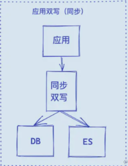
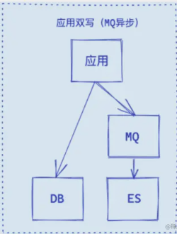

## 同步双写

在写入数据库时，也写入ES

优点：

- 业务逻辑简单；
- 实时性高。
  缺点：
- 硬编码，有需要写入 MySQL 的地方都需要添加写入 ES 的代码；
- 业务强耦合；
- 存在双写失败丢数据风险；
- 性能较差，本来 MySQL 的性能不是很高，再加一个 ES，系统的性能必然会下降。

## 异步双写

针对多数据源写入的场景，可以借助 MQ 实现异步的多源写入。

优点：

- 性能高；
- 不易出现数据丢失问题，主要基于 MQ 消息的消费保障机制，比如 ES 宕机或者写入失败，还能重新消费 MQ 消息；
- 多源写入之间相互隔离，便于扩展更多的数据源写入。

缺点：

- 硬编码问题，接入新的数据源需要实现新的消费者代码；
- 系统复杂度增加，引入了消息中间件；
- MQ是异步消费模型，用户写入的数据不一定可以马上看到，造成延时。

## 基于sql 定时扫描

优点：

- 不改变原来代码，没有侵入性、没有硬编码；
- 没有业务强耦合，不改变原来程序的性能；
- Worker 代码编写简单不需要考虑增删改查。
  缺点：
- 时效性较差，由于是采用定时器根据固定频率查询表来同步数据，尽管将同步周期设置到秒级，也还是会存在一定时间的延迟；
- 对数据库有一定的轮询压力，一种改进方法是将轮询放到压力不大的从库上。

> 经典方案：借助 Logstash 实现数据同步，其底层实现原理就是根据配置定期使用 SQL 查询新增的数据写入 ES 中，实现数据的增量同步。

## 基于biglog实时同步

上面三种方案要么有代码侵入，要么有硬编码，要么有延迟，那么有没有一种方案既能保证数据同步的实时性又没有代入侵入呢？

当然有，可以利用 MySQL 的 Binlog 来进行同步。

具体步骤如下：

* 读取 MySQL 的 Binlog 日志，获取指定表的日志信息；
* 将读取的信息转为 MQ；
* 编写一个 MQ 消费程序；
* 不断消费 MQ，每消费完一条消息，将消息写入到 ES 中。

优点：

* 没有代码侵入、没有硬编码；
* 原有系统不需要任何变化，没有感知；
* 性能高；
* 业务解耦，不需要关注原来系统的业务逻辑。

缺点：

* 构建 Binlog 系统复杂；
* 如果采用 MQ 消费解析的 Binlog 信息，也会像方案二一样存在 MQ 延时的风险。
