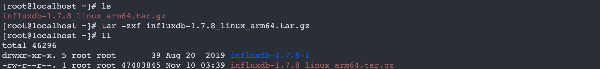
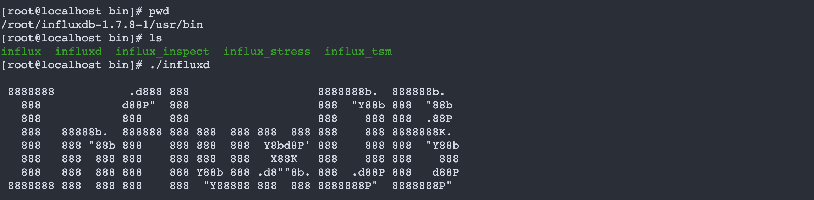
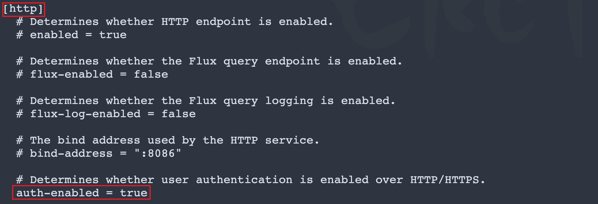
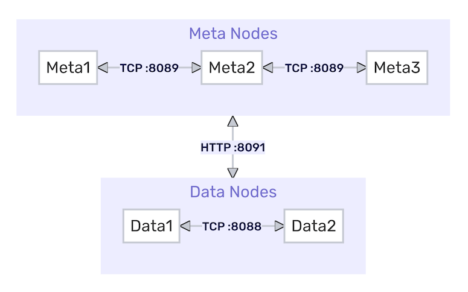
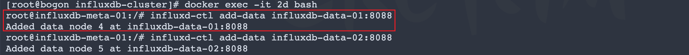
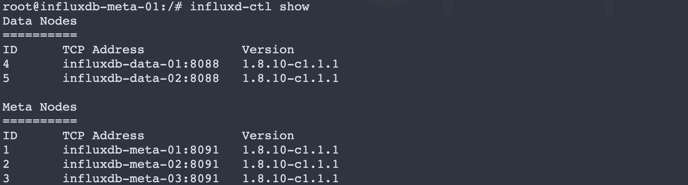
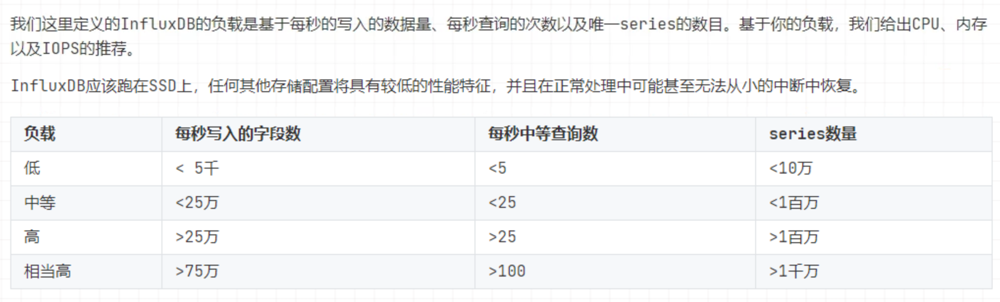

# InfluxDB 时序库

**官网地址:** https://www.influxdata.com/

**文档地址:** https://docs.influxdata.com/enterprise_influxdb/v1.8/

## 1 简介与场景

### 1.1 简介

InfluxDB是一个由InfluxData开发的**开源时序型数据**。它由**Go写成**，着力于**高性能地查询与存储时序型数据**。InfluxDB被广泛应用于存储系统的监控数据，IoT行业的实时数据等场景。

**时序: 跟时间有关数据 称之为时序**

InfluxDB有三大特性：

- Time Series （时间序列）：你可以使用与时间有关的相关函数（如最大，最小，求和等）

- Metrics（度量）：你可以实时对大量数据进行计算
- Eevents（事件）：它支持任意的事件数据

特点:

- 为时间序列数据专门编写的自定义高性能数据存储。 TSM引擎具有高性能的写入和数据压缩
- Golang编写，没有其它的依赖
- 提供简单、高性能的写入、查询 http api，Native HTTP API, 内置http支持，使用http读写
- 插件支持其它数据写入协议，例如 graphite、collectd、OpenTSDB
- 支持类sql查询语句
- tags可以索引序列化，提供快速有效的查询
- Retention policies自动处理过期数据
- Continuous queries自动聚合，提高查询效率
- schemaless(无结构)，可以是任意数量的列
- min, max, sum, count, mean,median 一系列函数，方便统计
- Built-in Explorer 自带管理工具

### 1.2 应用场景

时序数据以时间作为主要的查询纬度，通常会将连续的多个时序数据绘制成线，制作基于时间的多纬度报表，用于揭示数据背后的趋势、规律、异常，进行实时在线预测和预警，**时序数据普遍存在于IT基础设施、运维监控系统和物联网中。如:监控数据统计。** 每毫秒记录一下电脑内存的使用情况，然后就可以根据统计的数据，利用图形化界面（InfluxDB V1一般配合Grafana）制作内存使用情况的折线图；可以理解为按时间记录一些数据（常用的监控数据、埋点统计数据等），然后制作图表做统计；

## 2 安装

### 2.1 传统安装  

- 下载 influxdb 安装包

  https://portal.influxdata.com/downloads/

- 上传到 linux 系统中

  

- 解压缩安装包

  ```shell
  $ tar -zxf influxdb-1.7.8_linux_arm64.tar.gz 
  ```

  

- 进入解压缩目录查看目录结构

  ```shell
  [root@localhost influxdb-1.7.8-1]# ll
  total 0
  drwxr-xr-x. 4 root root 41 Aug 20  2019 etc
  drwxr-xr-x. 5 root root 41 Aug 20  2019 usr
  drwxr-xr-x. 4 root root 28 Aug 20  2019 var
  ```

- 目录说明

  - etc  主要用来存储 influxdb 系统配置信息
  - usr  主要用来存储 influxdb 操作相关脚本文件
  - var  主要用来存储 influxdb 运行日志、以及产生数据和依赖库文件

- 启动influxdb 进入usr/bin 目录执行

  ```shell
  $ ./influxd
  ```

  

- 客户端连接到 influxdb

  ```shell
  $ influx -database 'metrics' -host 'localhost' -port '8086' -username admin -password admin
  ```

  

### 2.2 docker 安装

```yml
version: '3.8'

volumes:
  influxdb:

services:
  influxdb:
    image: influxdb:1.7.8
    ports:
      - '8086:8086'
    volumes:
      - influxdb:/root/influxdb/data
      #- $PWD/influxdb.conf:/root/influxdb/influxdb.conf
    environment:
      - INFLUXDB_ADMIN_USER=root
      - INFLUXDB_ADMIN_PASSWORD=root
      - INFLUXDB_DB=history
    restart: always
```

### 2.3 客户端连接

- 命令行连接

  ```shell
  $ influx -database 'metrics' -host 'localhost' -port '8086' -username admin -password admin
  ```

  > **注意: 在操作时注意加入双引号用来区分influxdb中保留字和自定义字段冲突**

- 图形化工具连接

  下载地址: https://dbeaver.com/download/
  
  

## 3 相关概念

#### 3.1 概念

- database：数据库;               用来针对于不同应用进行数据隔离
- measurement：数据库中的表；      类似与关系型数据库中 table  row 记录
- points：表里面的一行数据。        point 相当于关系库中表中一条记录
- influxDB中独有的一些概念：Point由时间戳（time）、数据（field）和标签（tags）组成。

**库 database**

  **表 measurement**

​	**point =  time (主键 可以自动生成,手动指定 必须存在)+  field (普通字段 存储数据) + tags标签(索引 用来加快查询速度)**

​		field: 不经常查询数据 可以直接存储为 field

​		tags: 索引字段,主要用来提高查询效率 

#### 3.2 与MySQL概念对比

| 概念         | MySQL    | InfluxDB                                                     |
| :----------- | :------- | :----------------------------------------------------------- |
| 数据库（同） | database | database                                                     |
| 表（不同）   | table    | measurement（测量; 度量）                                    |
| 列（不同）   | column   | point = tag(带索引的，非必须)、field(不带索引)、timestemp(唯一主键) |

Point相当于传统数据库里的一行数据，如下表所示：

| Point属性            | 传统数据库中的概念                                          |
| -------------------- | ----------------------------------------------------------- |
| time（时间戳）       | 每个数据记录时间，是数据库中的主索引(会自动生成)            |
| fields（字段、数据） | 各种**记录值（没有索引的属性）也就是记录的值**：温度， 湿度 |
| tags（标签）         | 各种**有索引的属性**：地区，海拔                            |

`注意: 在influxdb中，字段必须存在。因为字段是没有索引的。如果使用字段作为查询条件，会扫描符合查询条件的所有字段值，性能不及tag。类比一下，fields相当于SQL的没有索引的列。tags是可选的，但是强烈建议你用上它，因为tag是有索引的，tags相当于SQL中的有索引的列。tag value只能是string类型`。

#### 3.3 类型说明

database 库;

  measurement 测量 表

​	point = time(必须存在 区域时间) + fields(字段: 必须存在, 没有索引字段) + tags(标签:可有可无 推荐使用: 有索引的字段) 

- **tag 类型**
  - tag都是`string`类型
- **field 类型**
  - field 支持四种类型 `int`, `float`, `string`, `boolean`

| 类型    | 方式         | 示例                      |
| ------- | ------------ | ------------------------- |
| float   | `小数`       | `power=21.1`              |
| int     | `整数`       | `age=18`                  |
| boolean | `true/false` | `boy=true`                |
| String  | `""` or `''` | `email="6099342@126.com"` |

## 4 基本操作

### 4.1 库 database

```sql
-- 库操作
- show databases;       查看所有库
- create database test; 创建一个库 
- drop   database test; 删除一个库
- use 	 test; 					选中一个库
- clear  database|db;   清除当前上下文的库
```

### 4.2 表 measurement

`注意: 表不能显示创建,插入数据时自动插入表中数据`

```sql
-- 表操作
- show measurements;				查看所有表
- drop measurement "test";	删除一个表 	#注意:删除表的时候,表名字最好加入双引号
```

### 4.3 插入 

```sql
-- 基本语法
- insert <retention policy> measurement,tagKey=tagValue fieldKey=fieldValue timestamp
- 如:
  insert user,name=blr,phone=110 id=20,email="6099342@126.com"
  从上面的输出，简单小结一下插入的语句写法:
  1). insert + measurement + "," + tag=value,tag=value + + field=value,field=value
  2). tag与tag之间用逗号分隔；field与field之间用逗号分隔
  3). tag与field之间用空格分隔
  4). tag都是string类型，不需要引号将value包裹
  5). field如果是string类型，需要加引号
```

- **注意:**
  - `更新: 如果在插入数据时,插入的数据的时间和 tags 与原有数据一致 则更新当前数据`

### 4.4 查询 

- **测试数据**

```sql
insert test,person_name=blr age=23,name="xiaochen",address="beijing";
insert test,person_name=xiaoblr age=24,name="xiaochenblr",address="tianjin";
insert test,person_name=blrxiao age=25,name="xiaoblrchen",address="beijing";
insert test,person_name=xiaoblrming age=26,name="blrxiaochen",address="shanghai";
insert test,person_name=xiaohong age=27,name="xiaohong",address="neimeng";
insert test,person_name=xiaoming age=28,name="xiaoming",address="zhengzhou";
insert test,person_name=xiaojindou age=29,name="xiaojindou",address="qingdao";
insert test,person_name=xiaohei age=30,name="xiaohei",address="nanning";
insert test,person_name=xiaohei age=31,name="xiaohei",address="nanning";
```

- **普通查询**

```sql
0、查询所有 #注意: tags显示再查询结果最后
- select * from test;


1、查询所有的 tag 和 field
- select * form test where person_name='blr'
- select * from test where "name"='xiaochen' # name为 influxdb 关键字需要加入双引号区分

2、从单个measurement查询所有的field,不查tag
- select *::field from test

3、从单个measurement查询特定的field和tag.，# 注意：查询时至少要带上一个field key，如果只查询tag字段的话是查不到数据的
- select person_name,age from test

4、同时查询多张表  #注意: 返回是将每张表不同记录返回
- select * from test ,student


5、模糊查询
# 前缀匹配 ，相当于 mysql 的 like 'blr%'
- select * from test where person_name=~/^blr/

# 后缀匹配 ，相当于 mysql 的 like '%blr'
- select * from test where person_name=~/blr$/

# 前后匹配，相当于 mysql 的 like '%abc%'
- select * from test where person_name=~/blr/
```

- **聚合函数**
  - `注意事项：聚合函数只能对field字段进行操作，不能对tag字段操作，否则查询出来的列表是空的`

```sql
0、如果我就要对tag字段进行聚合函数计算怎么办？ 那我们可以通过子查询来实现：
- select distinct(person_name) from (select * from test);

1、count() 统计
# 查询某个field字段的中的非空值数量 
- select count(age) from test;

2、DISTINCT() 去重
- select distinct(age) from test;

3、MEAN() 求平均值，这个平均值必须是数字类型
- select mean(age) from test;

4、MEDIAN() 求中位数，从单个字段（field）中的排序值返回中间值
# 中位数统计学中的专有名词，是按顺序排列的一组数据中居于中间位置的数，代表一个样本、种群或概率分布中的一个数值，其可将数值集合划分为相等的上下两部分。
- select median(age) from test;

5、SPREAD() 返回字段的最小值和最大值之间的差值。数据的类型必须是长整型或float64
- select spread(age) from test;

6、SUM() 求和
- select sum(age) from test;

7、BOTTOM() 返回一个字段中最小的N个值。字段类型必须是长整型或float64类型。
- select bottom(age,3) from test;

8、FIRST() 返回一个字段中时间最早取值
- select first(age) from test;

9、LAST() 返回一个字段中时间最晚取值。
- select last(age) from test

10、MAX() 求最大值
- select max(age) from test
```

- **分组聚合**

```sql
1、基于时间分组
# 查询所有数据，并对其划分为每200毫秒一组
select count(age) from test   group by time(200ms) 
# 查询所有数据，并对其划分为每200秒一组
select count(age) from test   group by time(200s) 
# 查询所有数据，并对其划分为每12分钟一组
select count(age) from test   group by time(12m) 
# 查询所有数据，并对其划分为每12小时一组
select count(age) from test   group by time(12h) 
# 查询所有数据，并对其划分为每12天一组
select count(age) from test   group by time(12d) 
# 查询所有数据，并对其划分为每12周一组
select count(age) from test   group by time(12w)
```

- **分页查询**

```sql
LIMIT 用法有2种:
	1. limit 10：查询前10条数据
  2. limit size offset N： size表示每页 大小，N表示第几条记录开始查询
  
# 查询前10条数据
- select * from test limit 10
# 分页，pageSize 为每页显示大小， pageIndex 为查询的页数
 pageIndex = 1
 pageSize = 10
- select * from test limit pageSize offset (pageIndex-1)*pageSize
```

- **排序**

```sql
# 升序
select * from test order by time asc
# 降序
select * from test order by time desc
```

- **in 查询**

```sql
#关系型数据库可以用in关键字来查询多个值，就像这样
select * from test where person_name in ('张三'，'李四'，'王五');
#但是时序数据库是没有 in 查询的，虽然in是保留的关键字，但是依然有办法解决, 还记得刚刚的模糊查询吗？没错，就是用它来解决这个问题

# 同时匹配 123 和  thing ，因为前后都机上了 ^  和 $ ，所以这已经不是模糊查询，而是完全匹配才会查询出来
select * from test where person_name =~/^123$|^thing$/
```

### 4.5 保留策略

influxDB是没有提供直接删除数据记录的方法，但是提供数据保存策略，主要用于指定数据保留时间，超过指定时间，就删除这部分数据。（数据库过期策略至少一个小时），默认保存策略为永久保存。**注意: 应用范围->库** 

##### 查看数据保存策略

```sql
# 查看某个库的策略
show retention policies on "数据库名称"
# 查看当前库下的策略，需要先用 use database 命令指定库名
show retention policies
```

**查询结果如下**

```sql
> SHOW RETENTION POLICIES ON logs
name    duration    shardGroupDuration    replicaN    default
atuogen    0        168h0m0s                  1        true
```

- name: 策略名称
- duration：数据保存时间，超过这个时间自动删除，0表示永久保存
- shardGroupDuration：shardGroup的存储时间，shardGroup是InfluxDB的一个基本储存结构，在这个时间内插入的数据查询较快，数据存放大于168小时查询速度降低；
- replicaN：全称是REPLICATION，副本个数
- default：是否默认策略

##### 创建数据保留策略

```sql
# 1.创建h（小时），d（天），w（星期）
- CREATE RETENTION POLICY "保留策略名称" ON "数据库名称" DURATION "该保留策略对应的数据过期时间" REPLICATION "复制因子，开源的InfluxDB单机环境永远为1" SHARD DURATION "分片组的默认时长" DEFAULT


- create retention policy "logs_policy" on logs duration 72h   replication 1 SHARD DURATION 168h default
`注意: duration过期时间必须大于等于>=shardGroupDuration时间`

# 2.修改保留策略
- alter retention policy "保留策略名称" on "数据库名称" duration 1d

# 修改默认保留策略
- alter retention policy "保留策略名称" on "数据库名称" default

# 3.删除保留策略
- drop retention policy "保留策略名称" on "数据库名称"
```

## 5 权限配置

### 5.1 开启权限

> 默认情况下 InfluxDB 是没有开启权限配置的, 即默认情况下所有客户端可直接连接操作 InfluxDB  服务进行相关操作,但是这在生产环境中是不可取的因此需要对 influxdb 服务加入权限相关配置。

#### 1 创建用户信息

- 首先通过客户端连接到服务，查看当前用户

  ```sql
  - show users
  ```

- 创建用户

  - 创建超级管理员用户

    ```sql 
    -  语法:  create user "用户名" with password '密码' with all privileges;
    -  如:    r
    ```

    **注意: 用户名必须使用双引号,密码必须使用单引号**

  - 创建指定库只读用户

    ```sql
    - create user "用户名" with password '密码'
    - grant read on 库名 to "用户名"
    ```

- 删除用户

  ```sql
  drop user "用户名"
  ```

#### 2 配置文件中开启

- 进入 influxdb 安装目录中 etc/influxdb

- 编辑 influxdb.conf 文件

  ```conf
  [http]
    auth-enabled = true
  ```

  

- 指定配置文件重启 InfluxDB 服务

  ```shell
  ./influxd -config=/root/influxdb-1.7.8-1/etc/influxdb/influxdb.conf
  ```

## 6 API 操作

**测试数据**

```sql
create database history;
use history;
-- 数据
insert actual,id=1,origin=master wind=10.0,power=20.2,cpu=24.0 1669285686487
insert actual,id=2,origin=slave wind=19.0,power=13.2,cpu=25.0 1669285686487
insert actual,id=3,origin=master wind=14.0,power=34.4,cpu=26.0 1669285686487
insert actual,id=4,origin=slave wind=12.0,power=23.5,cpu=27.0 1669285686487
insert actual,id=5,origin=master wind=10.0,power=14.7,cpu=23.0 1669285686487
insert actual,id=6,origin=slave wind=14.0,power=32.2,cpu=28.0 1669285686487
insert actual,id=7,origin=master wind=16.0,power=44.7,cpu=21.0 1669285686487
insert actual,id=8,origin=slave wind=19.0,power=45.8,cpu=22.0 1669285686487
insert actual,id=9,origin=master wind=13.0,power=46.2,cpu=24.0 1669285686487
```

### 6.1 引入依赖

```xml
<dependency>
   <groupId>org.influxdb</groupId>
   <artifactId>influxdb-java</artifactId>
   <version>2.23</version>
</dependency>
```

### 6.2 Java 操作

##### 1.获取连接

```java

public class TestConnection {

    private InfluxDB influxDB;

    @Before
    public void getConnection(){
        influxDB = InfluxDBFactory.connect("http://172.16.225.146:8086","root","root");
    }

    @After
    public void closeConnection(){
        influxDB.close();
    }
}
```

##### 2.库操作

```java
/**
  * 库的基本操作 创建一个库  使用一个库   删除一个库
  */
@Test
public void testDataBase(){
  //1.创建一个库 create database 库名
  influxDB.query(new Query("create database logs"));
  //2.使用一个库
  influxDB.setDatabase("history");
  //3.查询存在那些库
  QueryResult queryResult = influxDB.query(new Query("show databases"));
  System.out.println(queryResult);
  //4.删除一个库
  influxDB.query(new Query("drop database logs"));

  //5.判断库是否存在 需要使用 query 查询,查询之后再结果中进行判断处理
  boolean logs = influxDB.databaseExists("logs");//不推荐

  QueryResult result = influxDB.query(new Query("show databases"));
  List<QueryResult.Result> results = result.getResults();
  results.forEach(res -> {
    List<QueryResult.Series> series = res.getSeries();
    for (int i = 0; i < series.size(); i++) {
      List<List<Object>> values = series.get(i).getValues();
      values.forEach(val-> System.out.println(val));
    }
  });
}
```

##### 3.插入

- 单条插入

```java
@Test
public void testInsert() {
  influxDB.setDatabase("history");
  Point point = Point.measurement("actual")
    .tag("id", "10")
    .tag("origin", "slave")
    .addField("cpu", 25.0)
    .addField("wind", 19.0)
    .addField("power", 34.2)
    .time(new Date().getTime(), TimeUnit.MILLISECONDS)
    .build();
  influxDB.write(point);
}
```

- 批量插入

```java
@Test
public void testBatchInsert() {
  influxDB.setDatabase("history");
  Point point = Point.measurement("actual")
    .tag("id", "10")
    .tag("origin", "slave")
    .addField("cpu", 25.0)
    .addField("wind", 19.0)
    .addField("power", 34.2)
    .time(new Date().getTime(), TimeUnit.MILLISECONDS)
    .build();
  influxDB.write(BatchPoints.builder().points(point).build());
}
```

##### 4.查询

series: 维度  = time + tags 组合

```java
@Test
public void testQuery() {
  influxDB.setDatabase("history");
  QueryResult queryResult = influxDB.query(new Query(" select * from actual"));
  System.out.println(queryResult);
  List<QueryResult.Result> results = queryResult.getResults();
  for (QueryResult.Result result : results) {
    List<QueryResult.Series> series = result.getSeries();
    for (QueryResult.Series serie : series) {
      List<String> columns = serie.getColumns();
      List<List<Object>> values = serie.getValues();
      for (int i = 0; i < values.size(); i++) {
        List<Object> points = values.get(i);
        for (int j = 0; j < points.size(); j++) {
          System.out.println("column: " + columns.get(j) + " value: " + points.get(j));
        }
        System.out.println("=======================================");
      }
    }
  }
}
```

##### 5.策略

```java
/**
  * 保留策略
  */
@Test
public void testPolicy(){
  //1.选择一个库
  influxDB.setDatabase("history");
  //2.查询当前库策略
  QueryResult queryResult = influxDB.query(new Query("show retention policies"));
  System.out.println(queryResult);
  //3.创建一个保留策略
  influxDB.query(new Query("create retention policy history_policy on history duration 168h   replication 1 shard duration 168h default"));
  //查询当前库策略
  QueryResult queryResult1 = influxDB.query(new Query("show retention policies"));
  System.out.println(queryResult1);
  //4.修改默认策略
  influxDB.query(new Query("alter retention policy autogen on history default "));

  //5.删除策略
  influxDB.query(new Query("drop retention policy history_policy on history"));
  //查询当前库策略
  QueryResult queryResult2 = influxDB.query(new Query("show retention policies"));
  System.out.println(queryResult2);
}
```

### 6.2 SpringBoot 操作

集成思路:

a.引入客户端依赖-java

b.创建 springboot 连接信息配置类  将配置信息交给 springboot 配置文件管理

c.创建 springboot 操作 influxdb 类  InfluxDBTemplate 

d.只需要在使用类中注入 InfluxdbTemplate

##### 1.引入依赖

```xml
<dependency>
  <groupId>org.springframework.boot</groupId>
  <artifactId>spring-boot-starter-web</artifactId>
</dependency>

<dependency>
  <groupId>org.springframework.boot</groupId>
  <artifactId>spring-boot-configuration-processor</artifactId>
</dependency>

<dependency>
  <groupId>org.influxdb</groupId>
  <artifactId>influxdb-java</artifactId>
  <version>2.23</version>
</dependency>
```

##### 2.创建连接信息类

```java
package com.blr.config;

import org.springframework.boot.context.properties.ConfigurationProperties;
import org.springframework.stereotype.Component;

@Component
@ConfigurationProperties("spring.influx")
public class InfluxdbProperties {
    private String url;
    private String username;
    private String password;
    private String database;
    private String retention;//保留策略
}
```

##### 3.创建操作配置类

```java
@Configuration
public class InfluxDBTemplate {


    //1.influxDBTemplate ---> influxdb---> 数据库 获取 influxdb 连接


    private final InfluxdbProperties influxdbProperties;

    private InfluxDB influxDB;

    @Autowired
    public InfluxDBTemplate(InfluxdbProperties influxdbProperties) {
        this.influxdbProperties = influxdbProperties;
        getInfluxDB();
    }

    /**
     * 获取 influxdb 连接
     */
    public void getInfluxDB() {
        if (influxDB == null) {
            influxDB = InfluxDBFactory.connect(influxdbProperties.getUrl(),
                    influxdbProperties.getUsername(),
                    influxdbProperties.getPassword());
            //设置使用数据库  保证库存在
            influxDB.setDatabase(influxdbProperties.getDatabase());
            //设置数据库保留策略 保证策略存在
            if (ObjectUtils.isEmpty(influxdbProperties.getRetention())) {
                influxDB.setRetentionPolicy(influxdbProperties.getRetention());
            }
        }
    }

    /**
     * 关闭连接
     */
    public void close() {
        if (influxDB != null) {
            influxDB.close();
        }
    }


    /**
     * 指定时间插入
     *
     * @param measurement 表
     * @param tags        标签
     * @param fields      字段
     * @param time        时间
     * @param unit        单位
     */
    public void write(String measurement, Map<String, String> tags, Map<String, Object> fields, long time, TimeUnit unit) {
        Point point = Point.measurement(measurement).tag(tags).fields(fields).time(time, unit).build();
        influxDB.write(point);
        close();
    }

    /**
     * 插入数据-自动生成时间
     *
     * @param measurement 表
     * @param tags        标签
     * @param fields      字段
     */
    public void write(String measurement, Map<String, String> tags, Map<String, Object> fields) {
        write(measurement, tags, fields, System.currentTimeMillis(), TimeUnit.MILLISECONDS);
    }

    /**
     * 批量插入
     *
     * @param points 批量记录  推荐 1000 条作为一个批
     */
    public void writeBatch(BatchPoints points) {
        influxDB.write(points);
        close();
    }


    /**
     * 用来执行相关操作
     *
     * @param command 执行命令
     * @return 返回结果
     */
    public QueryResult query(String command) {
        return influxDB.query(new Query(command));
    }


    /**
     * 创建数据库
     *
     * @param name 库名
     */
    public void createDataBase(String name) {
        query("create database " + name);
    }

    /**
     * 删除数据库
     *
     * @param name 库名
     */
    public void dropDataBase(String name) {
        query("drop database " + name);
    }

    /**
     * select 查询封装
     *
     * @param queryResult 查询返回结果
     * @param clazz       封装对象类型
     * @param <T>         泛型
     * @return 返回处理回收结果
     */
    public <T> List<T> handleQueryResult(QueryResult queryResult, Class<T> clazz) {
        //0.定义保存结果集合
        List<T> lists = new ArrayList<>();
        //1.获取结果
        List<QueryResult.Result> results = queryResult.getResults();
        //2.遍历结果
        results.forEach(result -> {
            //3.获取 series
            List<QueryResult.Series> seriesList = result.getSeries();
            //4.遍历 series
            seriesList.forEach(series -> {
                //5.获取的所有列
                List<String> columns = series.getColumns();
                //6.获取所有值
                List<List<Object>> values = series.getValues();
                //7.遍历数据 获取结果
                for (int i = 0; i < values.size(); i++) {
                    try {
                        //8.根据 clazz 进行封装
                        T instance = clazz.newInstance();
                        //9.通过 spring 框架提供反射类进行处理
                        BeanWrapperImpl beanWrapper = new BeanWrapperImpl(instance);
                        HashMap<String, Object> fields = new HashMap<>();
                        for (int j = 0; j < columns.size(); j++) {
                            String column = columns.get(j);
                            Object val = values.get(i).get(j);
                            if ("time".equals(column)) {
                                beanWrapper.setPropertyValue("time", Timestamp.from(ZonedDateTime.parse(String.valueOf(val)).toInstant()).getTime());
                            } else {
                                //保存当前列和值到 field map 中 //注意: 返回结果无须在知道是 tags 还是 fields  认为就是字段和值 可以将所有字段作为 field 进行返回
                                fields.put(column, val);
                            }
                        }
                        //10.通过反射完成 fields 赋值操作
                        beanWrapper.setPropertyValue("fields", fields);
                        lists.add(instance);
                    } catch (InstantiationException | IllegalAccessException e) {
                        throw new RuntimeException(e);
                    }
                }
            });
        });
        return lists;
    }


    /**
     * 查询返回指定对象
     *
     * @param selectCommand select 语句
     * @param clazz         类型
     * @param <T>           泛型
     * @return 结果
     */
    public <T> List<T> query(String selectCommand, Class<T> clazz) {
        return handleQueryResult(query(selectCommand), clazz);
    }
}
```

##### 4.使用

> 在需要使用类中注入 InfluxDBTemplate 即可

```java
@Service
public class DemoServiceImpl{
    @Autowired
    private final InfluxDBTemplate influxDBTemplate;
		//....
}
```

## 7 集群

influxdb 开源 单机环境 1.x 

cluster 集群环境收费 收费 商业版本(功能最全 集群方案最好)

参考: https://github.com/chengshiwen/influxdb-cluster/wiki (可以实现冗余备份 高可用)

### 7.1 简介

- InfluxDB Cluster 是一个开源的 **时间序列数据库**，**没有外部依赖**。它对于记录指标、事件和执行分析很有用。

- InfluxDB Cluster 启发于 [InfluxDB Enterprise](https://docs.influxdata.com/enterprise_influxdb/v1.8/)、[InfluxDB v1.8.10](https://github.com/influxdata/influxdb/tree/v1.8.10) 和 [InfluxDB v0.11.1](https://github.com/influxdata/influxdb/tree/v0.11.1)，旨在替代 InfluxDB Enterprise。

- InfluxDB Cluster 易于维护，可以与上游 [InfluxDB 1.x](https://github.com/influxdata/influxdb/tree/master-1.x) 保持实时更新。

### 7.2 特性

- 内置 [HTTP API](https://docs.influxdata.com/influxdb/latest/guides/writing_data/)，无需编写任何服务器端代码即可启动和运行。
- 数据可以被标记 tag，允许非常灵活的查询。
- 类似 SQL 的查询语言。
- 集群支持开箱即用，因此处理数据可以水平扩展以。**集群目前处于生产就绪状态**。
- 易于安装和管理，数据写入查询速度快。
- 旨在实时应答查询。这意味着每个数据点在到时都会被计算索引，并且在 < 100 毫秒内返回的查询中立即可用。

### 7.3 架构

InfluxDB Cluster 安装由两组独立的进程组成：**Data 节点和 Meta 节点**。集群内的通信如下所示：



**Meta 节点:**

元节点持有以下所有的元数据:

- 集群中的所有节点和它们的角色。
- 集群中存在的所有数据库和保留策略。
- 所有分片和分片组，以及它们存在于哪些节点上。
- 集群用户和他们的权限。
- 所有的连续查询。

**Data 节点:**

数据节点持有所有的原始时间序列数据和元数据，包括:

- 测量值
- 标签键和值
- 字段键和值

**说明:**

Meta 节点通过 TCP 协议和 Raft 共识协议相互通信，默认都使用端口 `8089`，此端口必须在 Meta 节点之间是可访问的。默认 Meta 节点还将公开绑定到端口 `8091` 的 HTTP API，`influxd-ctl` 命令使用该 API。

Data 节点通过绑定到端口 `8088` 的 TCP 协议相互通信。Data 节点通过绑定到 `8091` 的 HTTP API 与 Meta 节点通信。这些端口必须在 Meta 节点和 Data 节点之间是可访问的。

在集群内，所有 Meta 节点都必须与所有其它 Meta 节点通信。所有 Data 节点必须与所有其它 Data 节点和所有 Meta 节点通信。

### 7.4 集群搭建

#### 0. 要求

**Meta 要求**

生产环境安装过程设置三个 Meta 节点，每个 Meta 节点在自己的服务器上运行。

InfluxDB Cluster 需要 **至少三个 Meta 节点** 和 **奇数个 Meta 节点** 以实现高可用和冗余。

> **注 1**：InfluxDB Cluster 不建议超过三个 Meta 节点，除非您的服务器之间的通信存在长期可靠性问题。
>
> **注 2**：强烈建议不要在同一服务器上部署多个 Meta 节点，因为如果该特定服务器无响应，它会产生更大的潜在故障。InfluxDB Cluster 建议在占用空间相对较小的服务器上部署 Meta 节点。
>
> **注 3**：要使用单个 Meta 节点启动集群，请在启动单个 Meta 节点时传递 `-single-server` 标志。
>
> 假设有三台服务器：`influxdb-meta-01`, `influxdb-meta-02` 和 `influxdb-meta-03`。

**端口**: Meta 节点通过端口 `8088`、`8089` 和 `8091` 进行通信。

**Data 要求**

生产环境安装过程设置两个 Data 节点，每个 Data 节点在自己的服务器上运行。

InfluxDB Cluster 需要 **至少两个 Data 节点** 才能实现高可用性和冗余。

> **注 1**：没有要求每个 Data 节点都运行在自己的服务器上。但是，最佳实践是将每个 Data 节点部署在专用服务器上。
>
> **注 2**：InfluxDB Cluster 不能用作负载均衡器。您需要配置自己的负载均衡器以将客户端流量发送到端口 `8086`（[HTTP API](https://docs.influxdata.com/influxdb/v1.8/tools/api/) 的默认端口）。
>
> 假设有两台服务器：`influxdb-data-01` 和 `influxdb-data-02`。

**端口**: Data 节点通过端口 `8088`、`8089` 和 `8091` 进行通信。****


1.下载 docker-compose.yml 集群配置文件

https://github.com/chengshiwen/influxdb-cluster/blob/master/docker/quick/docker-compose.yml

```yml
version: "3.9"

services:

  influxdb-meta-01:
    image: chengshiwen/influxdb:1.8.10-c1.1.1-meta
    container_name: influxdb-meta-01
    hostname: influxdb-meta-01
    restart: unless-stopped
    networks:
      - influxdb-cluster

  influxdb-meta-02:
    image: chengshiwen/influxdb:1.8.10-c1.1.1-meta
    container_name: influxdb-meta-02
    hostname: influxdb-meta-02
    restart: unless-stopped
    networks:
      - influxdb-cluster

  influxdb-meta-03:
    image: chengshiwen/influxdb:1.8.10-c1.1.1-meta
    container_name: influxdb-meta-03
    hostname: influxdb-meta-03
    restart: unless-stopped
    networks:
      - influxdb-cluster

  influxdb-data-01:
    image: chengshiwen/influxdb:1.8.10-c1.1.1-data
    container_name: influxdb-data-01
    hostname: influxdb-data-01
    ports:
      - 8186:8086
    restart: unless-stopped
    networks:
      - influxdb-cluster

  influxdb-data-02:
    image: chengshiwen/influxdb:1.8.10-c1.1.1-data
    container_name: influxdb-data-02
    hostname: influxdb-data-02
    ports:
      - 8286:8086
    restart: unless-stopped
    networks:
      - influxdb-cluster
      
networks:
  influxdb-cluster:
```

2.启动集群

```shell
$ docker-compose up -d
```

>  注: 要持久化容器中的数据，请务必挂载所有 Meta 和 Data 节点的 /etc/influxdb 和 /var/lib/influxdb 目录。

3.关闭集群,并清理相关数据

```shell
$ docker-compose down    #关闭集群
$ docker-compose down -v #关闭集群,并清除数据
```

4.初始化集群

> 注意: 使用 docker exec 进入任意一个 **meta容器(必须是 meta 容器,不能使用 data 容器)** 中执行如下命令即可:

```shell
# 1.添加 meta 节点
$ influxd-ctl add-meta influxdb-meta-01:8091
$ influxd-ctl add-meta influxdb-meta-02:8091
$ influxd-ctl add-meta influxdb-meta-03:8091
```


```shell
# 2.添加 data 节点
$ influxd-ctl add-data influxdb-data-01:8088
$ influxd-ctl add-data influxdb-data-02:8088
```



```shell
# 3.查看集群节点
root@influxdb-meta-01:/# influxd-ctl show
Data Nodes
==========
ID      TCP Address             Version
4       influxdb-data-01:8088   1.8.10-c1.1.1
5       influxdb-data-02:8088   1.8.10-c1.1.1

Meta Nodes
==========
ID      TCP Address             Version
1       influxdb-meta-01:8091   1.8.10-c1.1.1
2       influxdb-meta-02:8091   1.8.10-c1.1.1
3       influxdb-meta-03:8091   1.8.10-c1.1.1
```



5.进入任意data 节点执行

```shell
# 创建库
$ create database history 
# 写入数据
$ insert cpu,name=m1 year=2022
# 查询数据
$ select * from cpu
```

## 8 优化

### 8.1 数据导入/导出

```shell
# 数据压缩导出
$ influx_inspect export  -compress -datadir "/var/lib/influxdb/data" -waldir "/var/lib/influxdb/wal" -out "/home/myDB" -database myDB
# 数据未压缩导出
$ influx_inspect export -datadir "/var/lib/influxdb/data" -waldir "/var/lib/influxdb/wal" -out "/home/myDB" -database myDB

# 数据压缩导入
$ influx -import -database myDB -path=/home/myDB -compressed  -precision=ns -username=root -password=root

# 数据未压缩导入
$ influx -import -database myDB -path=/home/myDB -compressed  -precision=ns -username=root -password=root
```

### 8.2 配置调优

对 InfluxDB 的配置优化，主要从一些配置参数出发提高InfluxDB的性能。

#### 1. 性能优化

Influxdb的存储引擎是TSM Tree(Time-Structured Merge Tree), 基本上整体思想和LSM Tree(Log-Structured Merge Tree)类似，做了一些时序场景下数据存储结构上的建模优化。`cache-snapshot-memory-size`值需要调大。

```json
[data]
  # CacheSnapshotMemorySize is the size at which the engine will
  # snapshot the cache and write it to a TSM file, freeing up memory
  cache-snapshot-memory-size = 562144000
```

`cache-snapshot-memory-size` 这个大小控制的是 LSM 中的 cache 的大小，当 cache 达到一定阈值后，cache 会落盘生成`tsm file`, 此时的 tsm file 的level为 level 0 , 两个相同 level 的 tsm file 会进行 compact 生成一个`level + 1`的 tsm file, 既两个`level 0`的tsm file会生成一个`level 1`的tsm file，这种设计既TSM tree的写入放大问题。

由于Influxdb是固定两个低level 文件compact成一个高一级 level的tsm file，所以如果cache size越小，dump成tsm file的频率越高，进而做compact的频率也越高，造成写入放大越显著，当写入的频率很高的场景下，会导致influxdb的吞吐下降非常明显。

compact频率变高后，Influxdb写入放大很重要一个原因是TSM file数据做了编码压缩磁盘占用空间，当compact时，需要对数据decode，会带来明显的性能损耗。

Influxdb为了优化这个问题，在做compact时分为optimize compact和full compact两种类型。在full compact场景下，首先会对tsm file中的block做decode，然后按照每个Block存储的point数量，将decode的Point value按照时间顺序重新encode成Block，然后写入到新的TSM file中，其中的性能损耗会非常显著。而在optimize场景下，不会读取block内部的数据，会对多个block拼接，减少性能消耗。

目前部分场景下Influxdb做compact还是会选择 full compact。optimize compact虽然会提升compact速度和减少compact的资源消耗，但是会引起查询放大问题：需要从多个block中才能获取到需要返回的数据。

**总结**

- `cache-snapshot-memory-size` 值理论上是越大越好，但是需要关注你的硬件配置。

- `cache-snapshot-memory-size` 值跟当前并发写入 tags 数量有关系，如果你的tags数很大的情况下，一定要调大这个值，如果tags数不多，只是少数tag的数据写入频率很高，那么这个值稍低也不会对性能有太大影响。

#### 2.数据层面

表  point = [time + tags](seriers 100w tags 10w) +fields 

`max-series-per-database`可调整为0，如注释所示：该参数控制每个db的最大的series数量。

`max-values-per-tag`可调整为0，如注释所示：该参数控制每个tag的tag_value数量。

```json
[data]
  # The maximum series allowed per database before writes are dropped.  This limit can prevent
  # high cardinality issues at the database level.  This limit can be disabled by setting it to
  # 0.
  max-series-per-database = 0
  
  # The maximum number of tag values per tag that are allowed before writes are dropped.  This limit
  # can prevent high cardinality tag values from being written to a measurement.  This limit can be
  # disabled by setting it to 0.
  # max-values-per-tag = 0
```

#### 3.查询超时

```json
  # The maximum time a query will is allowed to execute before being killed by the system.  This limit
  # can help prevent run away queries.  Setting the value to 0 disables the limit.
  # query-timeout = "100"
```

### 8.3 单节点硬件推荐




---

