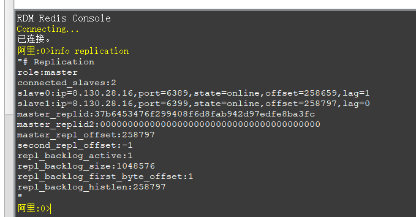
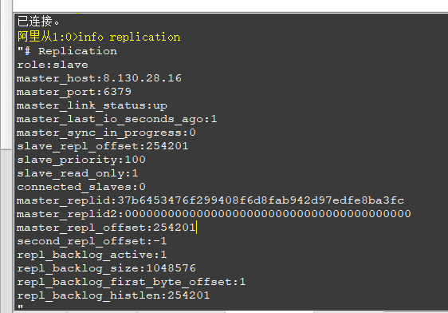

在大流量或高并发环境下，一般不会用单机模式，会搞分布式
```shell
在使用 Redis 主从复制模式的时候，一般会搭建多个从库（Slave），从库只支持读请求的处理，
用来分摊主库（Master）的读压力，主库（Master）只有一个，只专注于处理写请求，或者同时支持读写，
这样就可以实现读写分离，降低主库的读压力，也实现
```
### 实战,一台服务器
```shell
# 下载redis
[root@iZ0jlijkabn22h1nd3q4rnZ ~]# wget http://download.redis.io/releases/redis-5.0.5.tar.gz
# 解压redis
[root@iZ0jlijkabn22h1nd3q4rnZ ~]# tar -zxvf redis-5.0.5.tar.gz -C /usr/local/
[root@iZ0jlijkabn22h1nd3q4rnZ ~]# cd /usr/local/redis-5.0.5/
[root@iZ0jlijkabn22h1nd3q4rnZ redis-5.0.5]# make
[root@iZ0jlijkabn22h1nd3q4rnZ redis-5.0.5]# cd src/
# 启动
[root@iZ0jlijkabn22h1nd3q4rnZ src]# ./redis-server ../redis.conf &
# 启动成功没问题后关掉redis,复制两份redis
```
### 修改主服务
修改redis.conf
```shell
# 配置redis.conf
# 1. 注释掉此配置，表示所有主机都可以连接此服务。(注意：bind 的作用是绑定本机的网卡对应的IP地址,而非限制只有此ip访问，限制指定ip访问只能通过防火墙限制)
# bind 127.0.0.1
 
# 2. 保护模式修改为否，允许远程连接
protected-mode no
 
# 4. 设定密码
requirepass "123456"
 
# 5. 设定主库密码与当前库密码同步，保证从库能够提升为主库
masterauth "123456"
```
修改redis.conf
```shell
#指定监控的master,最后一位表示quorum(法人数量),即认定master'客观下线'成立的最低票数
sentinel monitor mymaster 8.130.28.16 6379 2
#主数据库密码
sentinel auth-pass mymaster 123456
```
### 修改从服务（2台从）
```shell
# 注释掉，允许任何服务访问
# bind 127.0.0.1
 
#设置端口号，一个6389，一个6399
prot 6389
# 指定主服务的地址
slaveof 8.130.28.16 6379
# 保护模式修改为否，允许远程连接
protected-mode no
# 设定从服务密码
requirepass "123456"
# 主服务密码
masterauth "123456"
```
```shell
#设置端口号,一台36379,一台46379
prot 36379
#指定监控的master
sentinel monitor mymaster 8.130.28.16 6379 2
#主数据库密码
sentinel auth-pass mymaster 123456
```
分别启动三个redis
```shell
#启动redis
./redis-server ../redis.conf &
#启动哨兵
./redis-sentinel ../sentinel.conf &
```

```shell
# 在主库写入数据
阿里:0>set b b
"OK"
# 从库查询
阿里从1:0>keys *
 1)  "b"
```