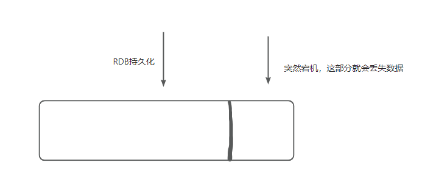
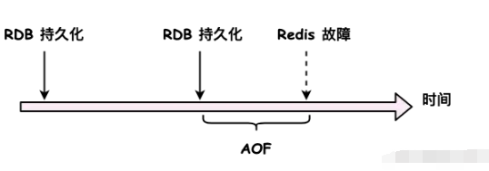

Redis持久化分为RDB和AOF，重点是RDB

## RDB
RDB就相当与把整个Redis内存进行一次快照，然后把这个快照持久化到.rdb文件。\
Redis 在重启时，可以通过加载 RDB 文件快速恢复 Redis 内存数据，但是需要说明的是，由于 RDB 持久化的快照特性，Redis 会丢失最后一次 RDB 文件到重启之间的数据

## AOF
AOF（Append Only File）持久化则是类似于增量的持久化，其核心思路是将 Redis 执行过的每条修改命令都保存到 AOF 文件中，从而实现持久化效果。当故障恢复的时候，Redis 可以根据 AOF 文件回放曾经执行过的每一条命令，这样的话，Redis 中的数据也就恢复到故障前的状态了。

在实际生产环境中，一般会使用 AOF + RDB 的混合持久化方案来达到最高效的持久化效果，这个方案是 RDB 定时全量持久化，这样在故障恢复时就可以将 Redis 恢复到 RDB 创建时的状态，然后回放 RDB 创建时间点到故障时间点之间的 AOF 日志，将 Redis 从 RDB 文件快照下的状态恢复到故障时间点的状态。