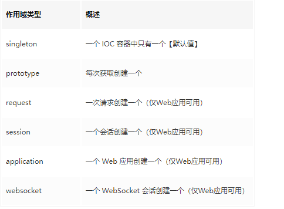

默认情况下，Bean 的作用域是单实例的。

FactoryBean 创建 Bean 的规则是什么？创建 Bean 的时机是什么？
答：创建的规则就是通过实现接口定义的方法，创建的时机会随着IoC容器初始化而初始化，Bean的创建是懒加载，只有getObject的时候才会创建，并不会随着IOC容器而创建

单实例 Bean 与原型 Bean 的区别都有什么？
答：单实例更像是我们了解的单例，每一次从IoC请求相同Type的Bean，获取的都是同一个实例，即内存地址相同，而原型则会取出不同的实例，前者省资源，但需要考虑线程安全，后者则相反
