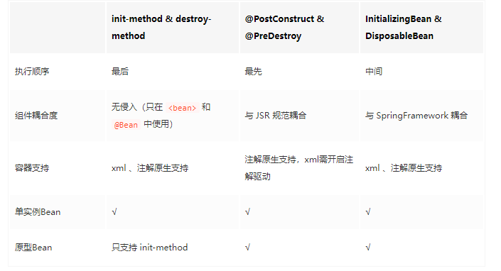

单实例 Bean 的生命周期是陪着 IOC 容器一起的，容器初始化，单实例 Bean 也跟着初始化（当然不绝对，后面会介绍延迟 Bean ）；容器销毁，单实例 Bean 也跟着销毁。原型 Bean 由于每次都是取的时候才产生一个，所以它的生命周期与 IOC 容器无关。

原型 Bean 的创建不随 IOC 的初始化而创建。

原型Bean的初始化动作与单实例Bean完全一致。

原型 Bean 在销毁时不处理 destroy-method 标注的方法。

