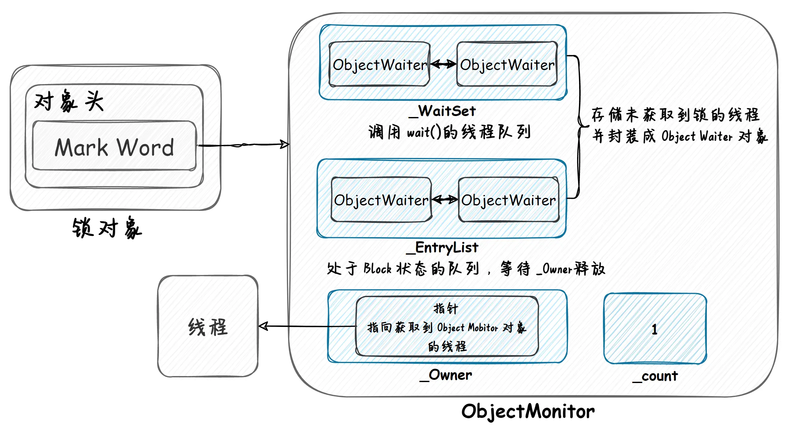

多个线程争抢资源时，会产生死锁的情况：
死锁的发生必须满足以下四个条件：

- 互斥条件：一个资源每次只能被一个进程使用。
- 请求与保持条件：一个进程因请求资源而阻塞时，对已获得的资源保持不放。
- 不剥夺条件：进程已获得的资源，在末使用完之前，不能强行剥夺。
- 循环等待条件：若干进程之间形成一种头尾相接的循环等待资源关系。

`避免死锁最简单的方法就是阻止循环等待条件，
将系统中所有的资源设置标志位、排序，
规定所有的进程申请资源必须以一定的顺序（升序或降序）做操作来避免死锁。`

